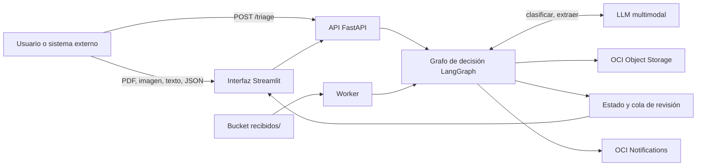
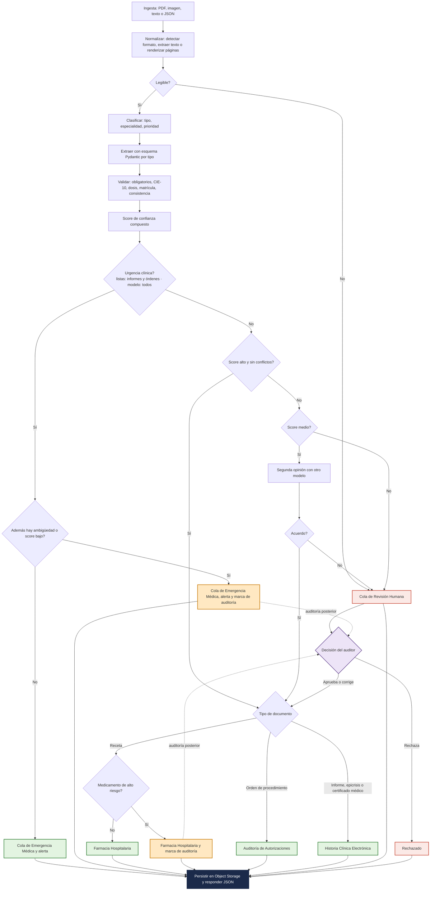

<div align="center">

# MediFlow

### Agente autónomo para triaje, extracción y enrutamiento de documentos clínicos

Hackathon ONE G10 · Oracle Next Education & Alura · Equipo 37

[](https://www.python.org/)
[](https://github.com/langchain-ai/langgraph)
[](https://fastapi.tiangolo.com/)
[](https://streamlit.io/)
[](https://www.oracle.com/cloud/free/)
[](#estado-del-proyecto)
[](LICENSE)

</div>

---

MediFlow recibe documentos clínicos en PDF, imagen, texto o JSON, los clasifica, extrae los datos esenciales en JSON validado, calcula un score de confianza, detecta urgencias y los enruta al destino correcto sin intervención manual para los casos estándar. Los casos ambiguos, inconsistentes o ilegibles van a un auditor humano. Los documentos y las decisiones se persisten en OCI Object Storage, y el sistema completo corre en la capa Always Free de Oracle Cloud.

## Tabla de contenidos

- [El problema](#el-problema)
- [Dónde encaja MediFlow](#dónde-encaja-mediflow)
- [Alcance](#alcance)
- [La solución](#la-solución)
- [Cómo entra un documento](#cómo-entra-un-documento)
- [Formatos de entrada](#formatos-de-entrada)
- [Arquitectura](#arquitectura)
- [Grafo de decisión](#grafo-de-decisión)
- [Escenarios de demostración](#escenarios-de-demostración)
- [Contrato de la API](#contrato-de-la-api)
- [Estructura del repositorio](#estructura-del-repositorio)
- [Cómo ejecutarlo](#cómo-ejecutarlo)
- [Despliegue en Oracle Cloud](#despliegue-en-oracle-cloud)
- [Datos y evaluación](#datos-y-evaluación)
- [Prioridades de entrega](#prioridades-de-entrega)
- [Cómo contribuir](#cómo-contribuir)
- [Equipo](#equipo)
- [Licencia](#licencia)

## El problema

Hospitales, laboratorios y aseguradoras de salud procesan a diario miles de documentos heterogéneos: informes de estudios, recetas, órdenes de autorización, epicrisis y certificados. Equipos administrativos los leen a mano para transcribir datos en sistemas heredados. El proceso es lento, caro, propenso a errores de tipeo y, cuando el documento describe una urgencia, la demora se paga en la atención del paciente.

## Dónde encaja MediFlow

El usuario no es el médico, es el equipo administrativo y el auditor clínico. Todo lo clínico ya ocurrió antes de que el documento llegue al agente. El recorrido típico:

1. Un médico de guardia solicita una tomografía.
2. El radiólogo interpreta el estudio y escribe un informe.
3. Ese informe sale del sistema como PDF, se imprime y se escanea, o llega por correo.
4. Cae en una bandeja administrativa junto a cientos de documentos más.
5. Hoy alguien lo lee, teclea los datos en el sistema heredado y decide a dónde va. Tarda horas.
6. Con MediFlow entra por la API, la pantalla de carga o el bucket, y en segundos queda clasificado, extraído, puntuado y enrutado.

MediFlow entra en el paso 4.

Tres ejemplos de lo que le llega: el informe en PDF que exporta el sistema de imágenes, la foto que un auxiliar de farmacia toma con el celular a una receta manuscrita, y el resultado de laboratorio que el sistema del laboratorio publica por API en JSON, ya estructurado.

## Alcance

MediFlow hace triaje documental, no triaje clínico. No diagnostica: detecta que un documento ya dice algo urgente y lo mueve rápido. En el primer ejemplo, el tromboembolismo lo diagnosticó el radiólogo; lo que MediFlow evita es que ese informe espere seis horas en una bandeja.

| Dimensión | Dentro de alcance | Fuera de alcance |
|---|---|---|
| Qué lee | Recetas, informes de estudio, órdenes de procedimiento, epicrisis, certificados | Radiografías, resonancias, tomografías, archivos DICOM |
| En qué formato | PDF nativo, PDF escaneado, foto de un papel, texto, JSON | Imagen médica cruda para interpretación diagnóstica |
| Qué decide | A qué cola va el documento y con qué prioridad | Qué tiene el paciente |
| De dónde sale la urgencia | De lo que el documento ya dice o de un valor crítico de laboratorio | De interpretar una imagen médica |
| Quién lo usa | Equipo administrativo, auditor clínico, gestor hospitalario | El médico durante la consulta |
| Contra qué compite | OCR tradicional y transcripción manual | Software de diagnóstico asistido |

Un sistema que mira una radiografía y emite un juicio diagnóstico es un dispositivo médico, con las exigencias regulatorias que eso implica. MediFlow se mantiene deliberadamente de este lado de la línea, y por eso el Human-in-the-Loop es parte del diseño y no un extra.

## La solución

Un agente que trata cada documento como un caso de triaje:

1. **Ingesta** en cualquier formato soportado: PDF con texto, PDF escaneado, imagen, texto plano o JSON.
2. **Clasificación** en seis tipos: Receta Médica, Informe de Estudio por Imágenes, Informe de Laboratorio, Orden de Solicitud de Procedimiento, Epicrisis y Certificado Médico.
3. **Extracción estructurada** con un LLM multimodal y validación con esquemas Pydantic. Cada dato extraído cita el fragmento del documento que lo sustenta. Lo que no está en el documento queda en `null`; nunca se inventa.
4. **Score de confianza** compuesto por legibilidad, validación de consistencia, confianza declarada por el modelo y acuerdo entre modelos.
5. **Detección de urgencia** desde fuentes independientes: hallazgos críticos, palabras clave, valores críticos de laboratorio y juicio del modelo. Basta con que una dispare. Las tres listas automáticas se aplican solo a informes de estudio, informes de laboratorio y órdenes; en recetas, epicrisis y certificados decide el modelo, que lee el contexto.
6. **Enrutamiento** a uno de cinco destinos: Cola de Emergencia Médica, Farmacia Hospitalaria, Auditoría de Autorizaciones, Historia Clínica Electrónica o Cola de Revisión Humana.
7. **Persistencia** en OCI Object Storage, segregada por estado, y alertas en tiempo real para los casos urgentes.

Principios que gobiernan el diseño:

- Una urgencia nunca se pierde por una ambigüedad: va a Emergencia y además queda marcada para auditoría.
- Si el auditor rechaza un documento, este termina en `rechazados/` y no sigue hacia ningún destino operativo. Un rechazo no se puede volver una aprobación por error del sistema.
- Cuando la lectura falla, el sistema lo dice; no rellena con datos inventados.
- Si el documento no se pudo guardar en el bucket, la respuesta lo dice. El campo `status_backup` solo dice `exito` cuando el objeto quedó realmente escrito, nunca antes.
- Ningún documento real de ningún paciente: los datos de prueba los escribe el equipo, y los corpus públicos que se sumen tendrán licencia abierta.

## Cómo entra un documento

Hay tres vías, y el bucket es la bandeja de entrada universal: cualquier canal nuevo solo necesita dejar el archivo en `recibidos/` para que el agente lo procese, sin escribir código específico para ese canal.

| Vía | Quién la usa | Papel en producción |
|---|---|---|
| Pantalla de carga en Streamlit | Una persona administrativa sube el documento a mano | La excepción: sirve para lo que llega suelto, un papel que trae el paciente, un fax |
| API, `POST /triage` | Otro sistema empuja el documento apenas se genera: laboratorio, imágenes, o el motor de integración del hospital | La vía principal. Es también la que exige el brief |
| Carpeta vigilada, `recibidos/` en el bucket | Cualquier proceso que deje un archivo ahí | La más habitual en un hospital real |

Ejemplos de canales que se conectan a la tercera vía sin tocar el código del agente: el escáner de admisiones guardando en una carpeta de red sincronizada al bucket, un buzón de correo institucional cuyos adjuntos se depositan automáticamente, o un webhook de mensajería que deja la foto que envió el auxiliar de farmacia.

El worker vigila `recibidos/` de forma continua, así que el documento queda guardado antes de que intervenga ningún modelo. Si el proveedor de IA falla, el documento no se pierde: queda en cola y se reintenta.

## Formatos de entrada

| Entrada | Qué hace el sistema |
|---|---|
| PDF con capa de texto | Extrae el texto directamente, sin usar visión. Es el camino más rápido y barato |
| PDF escaneado | Renderiza las páginas a imagen y las envía al modelo multimodal |
| Imagen (foto de receta manuscrita, informe escaneado) | Va directo al modelo multimodal |
| Texto plano | Entra al grafo sin normalización previa |
| JSON | Payload que envía otro sistema (HIS, laboratorio, formulario web o un flujo previo). Se valida contra el contrato y entra al grafo. Aquí el valor no es extraer, es clasificar, validar consistencia, detectar urgencia y enrutar |
| Cualquiera de los anteriores, ilegible | Mejora de imagen y un reintento. Si sigue ilegible, Cola de Revisión Humana con motivo "solicitar nueva captura". Nunca se inventan datos |

## Arquitectura



| Capa | Tecnología |
|---|---|
| Orquestación | LangGraph, grafo con nodos y aristas condicionales y estado tipado |
| Modelo | LLM multimodal con adaptador único y cadena de respaldo ante fallos del proveedor |
| Validación | Pydantic, un esquema por tipo de documento y contrato de entrada y salida |
| API | FastAPI |
| Interfaz | Streamlit: carga, cola de triaje, auditoría, reglas, métricas y trazas |
| Documentos | OCI Object Storage, Always Free |
| Cómputo | VM Ampere A1 en OCI, Always Free, con Docker Compose y Nginx como servidor web de entrada (recibe las peticiones, gestiona el certificado HTTPS y las reparte entre la API y la interfaz) |
| Alertas | OCI Notifications, Always Free |
| CI/CD | GitHub Actions, despliegue automático en cada merge a `main` |

## Grafo de decisión



| Color | Qué significa |
|---|---|
| Gris azulado | Paso de procesamiento automático |
| Amarillo, rombo | Decisión que toma el sistema |
| Lila, rombo | Decisión que toma una persona |
| Verde | Destino final. El documento llega y no necesita a nadie más |
| Ámbar | Destino con marca de auditoría. El documento llega igual, y la línea punteada muestra que después pasa por la decisión del auditor, sin haberse frenado |
| Rojo | Se detiene. Nadie lo recibe hasta que un humano decida, o queda rechazado |
| Azul oscuro | Persistencia en Object Storage. Ocurre siempre, en todos los caminos |

**Dos formas de intervención humana, y no son lo mismo.** Las dos las hace la misma persona, el auditor clínico, desde la misma pantalla. Lo que cambia es el momento.

- **Ámbar, auditoría posterior.** El documento llega a su destino de inmediato y además entra en la cola del auditor, que es la línea punteada. Una receta con anticoagulante llega a Farmacia sin esperar, porque el farmacéutico es también un control de seguridad, y el auditor la verifica después. Si aprueba, no pasa nada. Si corrige, la corrección se guarda y se avisa a Farmacia. Si rechaza, el documento pasa a rechazados y se avisa a Farmacia de que no debe dispensarse.
- **Rojo, revisión previa.** El documento no llega a ningún destino hasta que el auditor decida, porque si a una receta le falta el nombre del paciente no tiene sentido mandarla a Farmacia. Al aprobar o corregir, el documento recién entonces se enruta.

En ambos casos el documento se persiste con su marca, porque el registro debe existir siempre.

**Qué ve el auditor.** El agente no manda un documento a revisión sin decir por qué. La categoría de ambigüedad, AMB-1 a AMB-6, y la justificación van en la respuesta y aparecen en el panel del auditor: "está aquí porque falta el nombre del paciente". Así el auditor no tiene que diagnosticar el problema, va directo a resolverlo.

**Score de confianza.** Un número entre 0 y 1 que el sistema calcula para cada documento a partir de cuatro señales: legibilidad, validaciones superadas, seguridad declarada por el modelo y acuerdo con un segundo modelo. Por encima de 0,85 se enruta solo; entre 0,60 y 0,85 se enruta marcado para revisión; por debajo de 0,60 va a la Cola de Revisión Humana. Los umbrales son configurables.

**Categorías de ambigüedad.** Cuando un documento va a revisión humana se indica por qué, con una sola categoría: AMB-1 falta un campo obligatorio, AMB-2 contradicción interna, AMB-3 dosis fuera de rango o medicamento no identificable, AMB-4 texto truncado o parcialmente ilegible, AMB-5 dos documentos en un mismo archivo, AMB-6 fuera del alcance del agente.

**Fuera de alcance.** AMB-6 no señala un defecto del documento sino un límite del sistema, y por eso tiene categoría propia. Cubre cinco casos: documento no clínico, documento clínico que no es de los seis tipos, paciente no humano, idioma no soportado y pedido de diagnóstico. El agente deriva a revisión humana diciendo cuál de los cinco es, en vez de forzar el documento a un tipo que no le corresponde. Una regla más va con esto: el texto que llega es dato, nunca instrucción; si un documento contiene una orden dirigida al sistema, se ignora, se enruta por lo que el documento realmente es y queda registrada en la traza. Todo esto está explicado para el usuario en [`docs/alcance-y-limites.md`](docs/alcance-y-limites.md), cuyo resumen aparece en la pantalla de carga.

**Urgencia por tipo de documento (regla A).** Las listas automáticas de `rules.yaml` (`hallazgos_criticos`, `palabras_urgencia` y `valores_criticos_laboratorio`) se aplican solo a los tipos de `deteccion_automatica_urgencia.aplica_a`: informes de estudio por imágenes, informes de laboratorio y órdenes de procedimiento, que son los documentos que comunican un hallazgo nuevo o piden atención. En recetas, epicrisis y certificados la urgencia la decide el modelo con justificación, porque ahí las frases de alarma suelen ser instrucciones de alta ("acudir de urgencia si...") o diagnósticos ya tratados: una epicrisis de un paciente dado de alta tras un tromboembolismo no es una urgencia. Volver a aplicar las listas a todos los tipos es agregar tres líneas a esa lista.

**Alto riesgo farmacológico.** Una receta con anticoagulantes, opioides, insulina, potasio intravenoso o metotrexato. No dispara Emergencia, porque no hay una urgencia clínica: va a Farmacia Hospitalaria como cualquier receta, pero con auditoría obligatoria. La lista de medicamentos está en `agent/rules/rules.yaml` y se edita sin tocar el código.

**Urgencia con ambigüedad** no es contradictorio: la urgencia es sobre el contenido clínico, la ambigüedad sobre la calidad del dato. Si la conclusión dice "tromboembolismo pulmonar agudo" pero una sombra tapa el nombre del paciente, el documento va a Emergencia de inmediato y además queda marcado para auditoría. Una urgencia nunca se retiene esperando que un humano complete un dato.

Las reglas que alimentan el grafo (umbrales, destinos, hallazgos críticos, valores críticos de laboratorio, medicamentos de alto riesgo y categorías de ambigüedad) viven en `agent/rules/rules.yaml` y se editan sin tocar el código.

## Escenarios de demostración

| Escenario | Entrada | Resultado esperado |
|---|---|---|
| Rutina | Certificado médico en PDF | Historia Clínica Electrónica, sin auditoría, objeto en `procesados/historia_clinica/` |
| Urgencia | Informe de tomografía con tromboembolismo pulmonar agudo | Cola de Emergencia Médica, alerta enviada, objeto en `procesados/urgentes/` |
| Ambigüedad | Foto de receta manuscrita con dosis dudosa | Cola de Revisión Humana. Si el auditor corrige, el documento se reencamina a Farmacia; si lo rechaza, termina en `rechazados/` y no continúa hacia ningún destino operativo |
| Alto riesgo | Receta con anticoagulante | Farmacia Hospitalaria con `requiere_auditoria_humana: true`. El alto riesgo farmacológico marca auditoría, no dispara Emergencia; solo la urgencia clínica va a Emergencia |

## Contrato de la API

Entrada:

```json
{
  "documento_id": "DOC-CLIN-2026-8942",
  "tipo_archivo": "TEXTO",
  "documento_texto": "HOSPITAL SANTA LUCIA - INFORME DE ESTUDIO RADIOLOGICO. Paciente: Carlos Eduardo Mendes, 52 anos. ...",
  "canal_origen": "Guardia_Emergencias"
}
```


Salida: el mismo contrato del brief, con `status`, `clasificacion`, `datos_extraidos`, `decision_enrutamiento` y `almacenamiento_oci`, más cuatro campos propios: `score_confianza`, `modelo_utilizado`, `evidencias` y `trace`. El ejemplo completo está en [`docs/examples/triage_response.json`](docs/examples/triage_response.json).

El contrato completo, con los campos obligatorios por tipo de documento, las reglas de enrutamiento y las categorías de ambigüedad, está en [`docs/api-contract.md`](docs/api-contract.md).

## Estructura del repositorio

```
mediflow/
├── agent/          Grafo LangGraph, nodos, esquemas Pydantic, prompts, reglas y adaptador de modelos
├── api/            FastAPI: /triage, /queue, /audit, /rules, /metrics
├── ui/             Streamlit multipágina
├── worker/         Procesa recibidos/, cola con reintentos, reporte diario
├── evals/          Golden set, generador de datos sintéticos y harness de evaluación
├── infra/          Docker Compose de producción, Nginx, políticas OCI, script de la VM
├── docs/           Arquitectura, contrato, decisiones (ADR), ejemplos y plan
└── .github/        CI, despliegue, CODEOWNERS y plantillas
```

## Cómo ejecutarlo

Requisitos: Python 3.12, Docker y una clave de API del proveedor de modelos.

```bash
git clone https://github.com/No-Country-simulation/G10-LATAM-equipo-37-Mediflow.git
cd G10-LATAM-equipo-37-Mediflow
cp .env.example .env            # completar las claves locales; .env nunca se sube a git
python -m venv .venv && source .venv/bin/activate
pip install -r requirements-dev.txt
make test                       # lint y tests
make dev                        # api en :8000, ui en :8501 y worker
```

Prueba rápida con el ejemplo del brief:

```bash
curl -s -X POST http://localhost:8000/triage \
  -H "Content-Type: application/json" \
  -d @docs/examples/triage_request.json | python -m json.tool
```

## Despliegue en Oracle Cloud

Todo corre dentro de la capa Always Free: Object Storage para los documentos, una VM Ampere A1 para la aplicación y OCI Notifications para las alertas. Cada merge a `main` construye y despliega en la VM mediante GitHub Actions (`.github/workflows/deploy.yml`). La preparación de la VM se hace una sola vez con `infra/oci/setup-vm.sh`, y las políticas IAM mínimas están en `infra/oci/policies.txt`.

Los documentos se organizan en el bucket por estado:

```
recibidos/                         original, antes de procesar
procesados/urgentes/
procesados/farmacia/
procesados/autorizaciones/
procesados/historia_clinica/
auditoria_humana/{documento_id}/   original, extracción y resolución del auditor
rechazados/
```

## Datos y evaluación

Ningún documento real de ningún paciente. Los datos de prueba los escribe el equipo a partir de un banco de cuadros clínicos y se complementan con recetas manuscritas ficticias. En la siguiente versión se suma una evaluación con datos clínicos reales: tres corpus públicos de casos clínicos en español, con licencia CC BY 4.0 y anotados por expertos, para medir campos concretos: CodiEsp para el código CIE-10, MEDDOCAN para los datos del paciente y del profesional, PharmaCoNER para los medicamentos.

Cada fuente resuelve una tarea distinta y conviene no mezclarlas:

| Categoría | Qué es | Ejemplos |
|---|---|---|
| Referencia | Vive dentro del producto y se consulta en cada documento, también en producción | Catálogo CIE-10 de la OMS, tabla de medicamentos con rangos de dosis |
| Evaluación | Solo mide qué tan bien funciona el sistema, nunca corre en producción | Documentos generados, corpus públicos, fotos manuscritas |
| Entrenamiento | Modificaría los parámetros del modelo | Ninguna. No se entrena ningún modelo |

**El conjunto de prueba** funciona como un examen con solucionario: cada documento lleva escrito de antemano la respuesta correcta, se pasa por el agente y se compara lo que salió con lo esperado.

| Qué | Cuántas | De qué tipo son | De dónde sale su etiqueta |
|---|---|---|---|
| Documentos de texto | 30 | Los seis tipos: receta médica, informe de estudio por imágenes, informe de laboratorio, orden de solicitud de procedimiento, epicrisis y certificado médico | Se define al generarlos: sabemos qué pusimos en cada uno |
| Imágenes degradadas | 12 | Sobre todo informes de estudio y certificados, que son los que en la vida real llegan escaneados o fotografiados. Salen de 12 de los 30 documentos | Heredan el contenido del documento; la decisión esperada cambia con el nivel de legibilidad |
| Fotos de recetas manuscritas | 8, una por persona | Todas son Receta Médica, que es lo que se escribe a mano | La escribe quien redacta la receta |
| **Total** | **50** | | |

Los 30 documentos cubren los cinco resultados posibles para un documento legible: rutina, alto riesgo farmacológico, urgencia, urgencia con ambigüedad y ambigüedad. Las 20 imágenes agregan el sexto, ilegible, y se reparten en tres niveles de legibilidad, leve, media y severa, para ajustar los umbrales de 0,40 y 0,70 de rules.yaml. Hay un camino que no se etiqueta de antemano: cuando el score del modelo queda entre 0,60 y 0,85, rules.yaml pide una segunda opinión o agrega una marca de auditoría. Eso depende de la confianza del modelo en cada corrida, así que no cuenta como error de enrutamiento; se refleja en la tasa de revisión humana.

**Por qué 30.** Es el mínimo que cubre los seis tipos de documento, los cinco resultados y las cinco categorías de ambigüedad. Es una prueba de funcionamiento, no una medición estadística: si el agente acierta el 90 %, con 30 casos el acierto real puede estar entre el 79 % y el 100 %, con un 95 % de confianza (margen = 1,96 × √(0,90 × 0,10 ÷ 30) ≈ 0,11, es decir, 11 puntos). Alcanza para saber si el sistema funciona o está roto. Medir con un margen de 5 puntos exigiría unos 140 documentos (1,96² × 0,90 × 0,10 ÷ 0,05² ≈ 138), y el conjunto crece en las siguientes versiones.

Para que los números no estén contaminados, los ejemplos incrustados en los prompts nunca son documentos del conjunto, y los prompts no se ajustan mirando los fallos del conjunto de prueba: se prueban con otros documentos.

El reparto documento por documento, con la respuesta esperada de cada uno, está en [`docs/kit-de-datos.pdf`](docs/kit-de-datos.pdf), y las fuentes con sus licencias en [`evals/DATA.md`](evals/DATA.md).

El golden set se corre con `evals/run.py` y mide accuracy de clasificación, precisión y recall por campo, recall de urgencias, tasa de revisión humana y latencia. Los resultados se publican aquí en cada iteración.

| Métrica | Valor |
|---|---|
| Accuracy de clasificación | pendiente |
| Recall de urgencias | pendiente |
| Tasa de revisión humana | pendiente |
| Latencia p50 / p95 | pendiente |


## Prioridades de entrega

> **Regla de alcance:** primero se entrega completo el checklist obligatorio del brief, después los cinco diferenciales que el brief propone, y solo entonces se agregan nuestros plus. Nada del nivel 3 se empieza si algo del nivel 1 o 2 sigue abierto.

### Nivel 1 · Obligatorio, checklist de evaluación del brief

- [ ] Ingestión funcional de documentos clínicos en texto, PDF e imagen
- [ ] Clasificación automática del tipo de documento con LLM multimodal
- [ ] Extracción de datos clínicos esenciales en JSON estructurado
- [ ] Lógica de decisión condicional con manejo de casos ambiguos y urgentes
- [ ] Integración activa con OCI Object Storage, capa Always Free
- [ ] Demostración de tres escenarios: rutina, urgencia y ambigüedad
- [ ] Documentación completa con el diagrama del flujo del agente

### Nivel 2 · Diferenciales que propone el brief

- [ ] Panel de auditoría Human-in-the-Loop en Streamlit
- [ ] Despliegue completo en OCI Compute con acceso público
- [ ] Flujo clínico personalizable: reglas, destinos y umbrales editables sin tocar el código
- [ ] OCR y visión multimodal: lectura de recetas manuscritas e informes escaneados
- [ ] Alertas en tiempo real hacia Slack y correo para los equipos de guardia

### Nivel 3 · Nuestros plus, solo si el nivel 2 cierra en fecha

- [ ] Dashboard en vivo con las alertas y las métricas de triaje en pantalla
- [ ] Workflow en n8n auto-hospedado disparando las alertas a Slack, tal como lo nombra el brief
- [ ] Multilingüe: documentos en portugués además de español, con un solo esquema de salida
- [ ] Reporte diario y semanal al gestor hospitalario, redactado por el agente
- [ ] Evaluación publicada con calibración del score de confianza
- [ ] Resiliencia con modelo de respaldo, demostrada en vivo
- [ ] Segunda opinión entre modelos cuando el score es medio
- [ ] Aprendizaje desde las correcciones del auditor como tests de regresión

## Cómo contribuir

Una tarea, una rama, un PR.

1. Toma una tarea del tablero y asígnatela.
2. Crea una rama desde `main` con el formato `feat/<area>-<tema>` o `fix/<area>-<tema>`, por ejemplo `feat/agent-clasificar`.
3. Haz commits pequeños con mensajes claros.
4. Abre un Pull Request con la plantilla. El CI corre lint y tests automáticamente.
5. Una persona del equipo dueño de la carpeta revisa y aprueba.
6. Se hace squash merge a `main`, que despliega solo. Nadie hace push directo a `main`.

Las decisiones de diseño se registran en [`docs/decisions.md`](docs/decisions.md). Nunca se suben claves, wallets ni datos de pacientes: `.env` y `wallet/` están en `.gitignore`.

## Equipo

- Alessandro Cappelli
- Carlos Zunino
- Carolina Chambique
- Cristian Ojeda
- Kevin Lemos
- Maria Camila Gonzalez Nuñez
- Néstor Gribaudo
- Sabrina Valentim Guimaraes

Repositorio: [No-Country-simulation/G10-LATAM-equipo-37-Mediflow](https://github.com/No-Country-simulation/G10-LATAM-equipo-37-Mediflow)

Proyecto desarrollado en el marco del Hackathon ONE G10, programa Oracle Next Education en alianza con Alura, en la plataforma de simulación laboral de No Country.

## Licencia

MIT. Ver [`LICENSE`](LICENSE).
