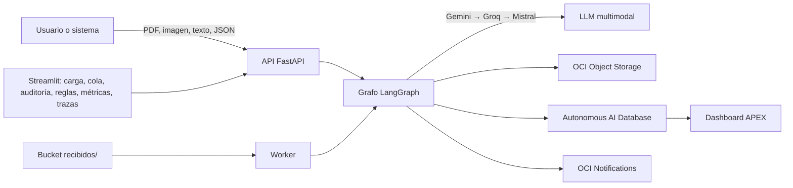

# MediFlow · Agente autónomo para triaje, extracción y enrutamiento de documentos clínicos

Hackathon ONE G10 · Oracle Next Education & Alura

> Estado: en construcción. Este README es la Tarea 1 de la plataforma y se actualiza cada viernes.

## El problema

Hospitales, laboratorios y aseguradoras pierden miles de horas leyendo informes y recetas a mano para pasar los datos a sistemas heredados. Es lento, caro, y los errores de tipeo y las demoras afectan a pacientes con cuadros urgentes.

## La solución

Un agente que recibe documentos clínicos en PDF, imagen, texto o JSON, los clasifica, extrae los datos esenciales en JSON validado, calcula un score de confianza, detecta urgencias y los enruta al destino correcto. Los casos ambiguos o ilegibles van a un auditor humano. Todo se persiste en OCI Object Storage y el sistema completo corre en la capa Always Free de OCI.

## Arquitectura

Ver `docs/architecture.md` (diagrama del grafo de decisión y componentes).



## Estructura del repositorio

```
mediflow/
  agent/          grafo LangGraph, nodos, esquemas Pydantic, prompts, reglas, adaptador de modelos
  api/            FastAPI: /triage, /queue, /audit, /rules, /metrics
  ui/             Streamlit multipágina
  worker/         procesa recibidos/, cola con reintentos, reporte diario
  evals/          golden set, generador de datos sintéticos, harness de evaluación
  infra/          docker-compose de producción, nginx, políticas OCI, script de la VM, terraform
  docs/           arquitectura, decisiones (ADR), contratos JSON, ejemplos, plan
  .github/        workflows de CI y deploy, CODEOWNERS, plantillas
```

## Cómo ejecutarlo en local

```bash
cp .env.example .env            # completar claves locales, nunca se sube a git
python -m venv .venv && source .venv/bin/activate
pip install -r requirements-dev.txt
make test                       # lint y tests
make dev                        # api en :8000, ui en :8501, worker
```

Prueba rápida con el ejemplo del brief:

```bash
curl -s -X POST http://localhost:8000/triage \
  -H "Content-Type: application/json" \
  -d @docs/examples/triage_request.json | python -m json.tool
```

## Despliegue en OCI

Cada merge a `main` despliega a la VM Always Free por GitHub Actions (`.github/workflows/deploy.yml`). Preparación de la VM en `infra/oci/setup-vm.sh` y políticas IAM en `infra/oci/policies.txt`.

## Evaluación

Golden set en `evals/golden/`, harness en `evals/run.py`. Métricas: accuracy de clasificación, precisión y recall por campo, recall de urgencias, tasa de revisión humana, latencia, costo por documento, calibración del score.

| Métrica | Valor |
|---|---|
| Accuracy de clasificación | pendiente |
| Recall de urgencias | pendiente |
| Tasa de revisión humana | pendiente |
| Latencia p50 / p95 | pendiente |

## Datos

Ningún documento real. Fuentes y licencias en `evals/DATA.md`.

## Decisiones

Registro de decisiones y trade-offs en `docs/decisions.md`.

## Equipo

Pendiente.

## Licencia

MIT. Ver `LICENSE`.
