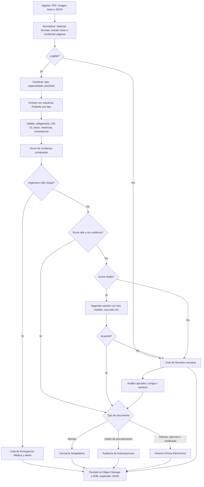

# Arquitectura

## Componentes

| Componente | Tecnología |
|---|---|
| LLM multimodal | Gemini (principal), Groq Llama 4 Scout y Mistral Small (respaldos), adaptador único con cambio automático |
| Orquestación | LangGraph |
| API | FastAPI |
| UI | Streamlit |
| Documentos | OCI Object Storage (Always Free) |
| Historial y reglas | Autonomous AI Database 26ai (Always Free), APEX para el dashboard |
| Alertas y reportes | OCI Notifications, OCI Email Delivery |
| Cómputo | VM Ampere A1 (Always Free), Docker Compose |
| Secretos | OCI Vault, instance principal |

## Grafo de decisión



## Layout de Object Storage

```
mediflow-documentos-clinicos/
  recibidos/{documento_id}.{pdf|png|jpg|txt|json}
  procesados/urgentes/{documento_id}.json
  procesados/farmacia/{documento_id}.json
  procesados/autorizaciones/{documento_id}.json
  procesados/historia_clinica/{documento_id}.json
  auditoria_humana/{documento_id}/original.{ext}
  auditoria_humana/{documento_id}/extraccion.json
  rechazados/{documento_id}.json
  reportes/diario/{fecha}.json
```
