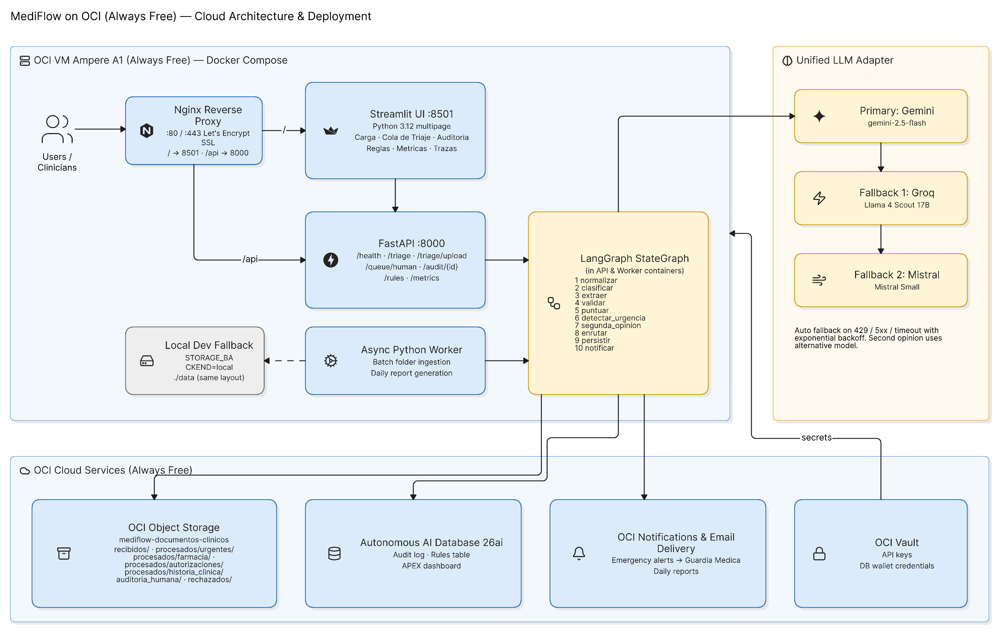
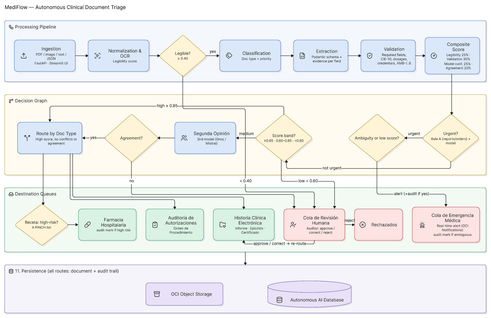
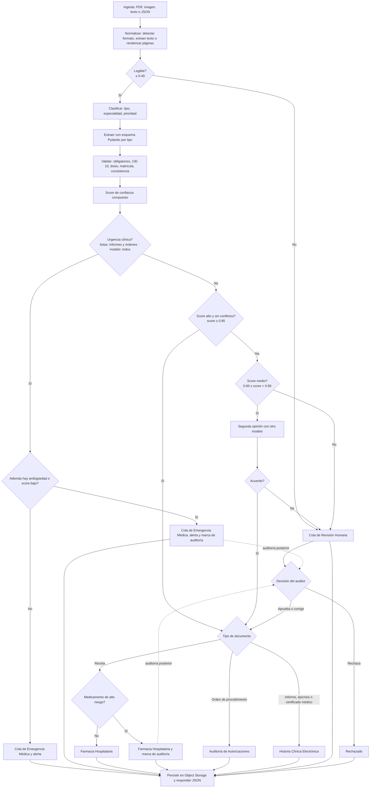
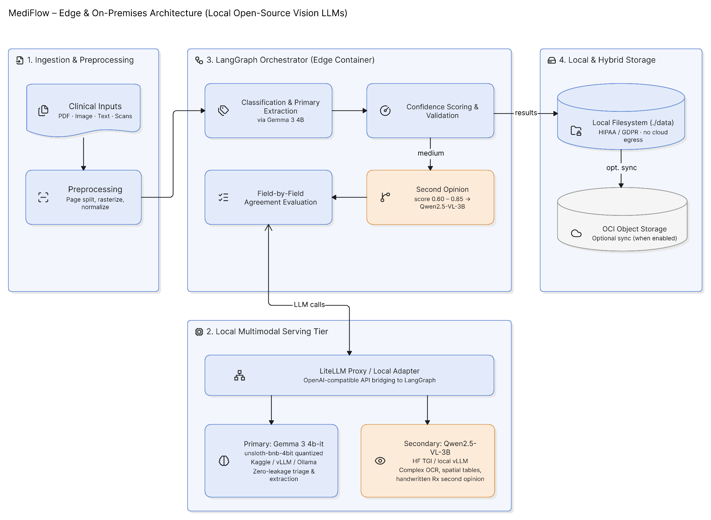

# Arquitectura de MediFlow

MediFlow es un agente autónomo para el triaje, extracción y enrutamiento de documentos clínicos, construido con **LangGraph**, **FastAPI**, **Streamlit** y desplegado sobre la capa **Always Free de Oracle Cloud Infrastructure (OCI)**.

El espacio de trabajo colaborativo con los diagramas interactivos editables vive en Eraser:
- **Workspace interactivo en Eraser:** [app.eraser.io/workspace/Mevzfxwvzbgo0NNnNXxP](https://app.eraser.io/workspace/Mevzfxwvzbgo0NNnNXxP) (compartido con el equipo).

---

## 1. Componentes del Sistema

| Componente | Tecnología | Responsabilidad |
|---|---|---|
| **Ingesta segura** | Python, PyMuPDF, Pillow, Tesseract OCR | Normalización de PDF, imágenes, texto y JSON. Render de páginas, cálculo inicial de legibilidad y extracción de texto de apoyo. |
| **Orquestación y Grafo** | LangGraph (StateGraph con 10 nodos) | Ejecución condicional del pipeline clínico: normalización, clasificación, extracción, validación, score compuesto, urgencia, segunda opinión, enrutamiento, persistencia y notificación. |
| **Adaptador multimodal de LLM** | LiteLLM + SDKs nativos | Cadena de modelos resiliente (Gemini 2.5 Flash principal → Groq Llama 4 Scout → Mistral Small). Reintentos automáticos con backoff exponencial y selección de modelo alternativo para segunda opinión. |
| **API Backend** | FastAPI + Uvicorn | Endpoints REST (`/triage`, `/triage/upload`, `/health`, `/queue/human`, `/audit/{id}`, `/rules`, `/metrics`). |
| **Interfaz de Usuario (UI)** | Streamlit multipágina | 6 pantallas: Carga, Cola de triaje, Auditoría Human-in-the-Loop, Reglas editables, Métricas operativas y Trazas en vivo ("ver pensar al agente"). |
| **Cómputo en producción** | VM Ampere A1 en OCI (4 OCPU, 24 GB RAM, Always Free) | Contenedores Docker orquestados con Docker Compose y Nginx como reverse proxy con SSL Let's Encrypt. |
| **Documentos y decisiones** | OCI Object Storage / Almacenamiento local | Bucket `mediflow-documentos-clinicos` con layout por estado. En desarrollo local opera en `./data` sin requerir credenciales de nube. |
| **Base de datos transaccional** | Autonomous AI Database 26ai (Always Free) | Historial de auditoría, persistencia de reglas y vistas analíticas APEX. |
| **Alertas y reportes** | OCI Notifications (ONS) y OCI Email Delivery | Canal de alertas críticas inmediatas hacia Guardia Médica y reporte diario automático al gestor hospitalario. |
| **Gestión de secretos** | OCI Vault / Variables de entorno | Claves de API de LLM y credenciales de bases de datos seguras. |

### Diagrama de componentes y despliegue



---

## 2. Grafo de Decisión del Agente

El grafo coincide estrictamente con las reglas vigentes en `agent/rules/rules.yaml` y la portada del proyecto (`README.md`):

1. **Normalizar:** Detecta formato, extrae texto digital o aplica OCR sobre escaneos, y evalúa legibilidad (0 a 1).
2. **Puerta de legibilidad:** Si la legibilidad es `< 0.40`, deriva directo a la **Cola de Revisión Humana** solicitando nueva captura, sin consumir llamadas a modelos.
3. **Clasificar:** Determina el tipo documental (6 tipos clínicos + `Otro`), especialidad y prioridad clínica.
4. **Extraer:** Extrae datos estructurados acordes al esquema Pydantic de cada tipo, adjuntando la cita de evidencia textual por cada campo.
5. **Validar:** Comprueba campos obligatorios, coherencia interna y evalúa las categorías de ambigüedad (`AMB-1` a `AMB-6`).
6. **Score de confianza compuesto:** Pondera 4 factores: Legibilidad (25%), Validación (30%), Confianza del modelo (25%) y Acuerdo entre modelos (20%).
7. **Urgencia clínica (Regla A):**
   - Las listas de hallazgos críticos y valores de laboratorio aplican a: **Informes de Imagenología**, **Informes de Laboratorio** y **Órdenes de Procedimiento**.
   - Si se detecta urgencia clínica:
     - **Con ambigüedad o score bajo:** Se enruta a **Cola de Emergencia Médica**, se emite alerta prioritaria y se adjunta **marca de auditoría posterior**.
     - **Sin ambigüedad:** Se enruta directo a **Cola de Emergencia Médica** con alerta prioritaria.
8. **Decisión por Score (sin urgencia):**
   - **Score Alto (≥ 0.85) sin conflictos:** Enrutamiento automático al destino por tipo de documento.
   - **Score Medio (0.60 a 0.85):** Dispara el nodo **Segunda Opinión** con un modelo alternativo. Si hay acuerdo, enruta al destino por tipo. Si hay discrepancia en campos esenciales, deriva a la **Cola de Revisión Humana**.
   - **Score Bajo (< 0.60):** Deriva a la **Cola de Revisión Humana**.
9. **Destinos operativos por tipo de documento:**
   - **Receta Médica:** Verifica medicamentos de alto riesgo (*A PINCH*). Si contiene alto riesgo farmacológico, enruta a **Farmacia Hospitalaria con marca de auditoría posterior**. Si es rutina, enruta directo a **Farmacia Hospitalaria**.
   - **Orden de Solicitud de Procedimiento:** Enruta a **Auditoría de Autorizaciones**.
   - **Informe de Estudio, Laboratorio, Epicrisis o Certificado:** Enruta a **Historia Clínica Electrónica (HCE)**.
   - **Otro o Fuera de alcance (AMB-6):** Enruta a **Cola de Revisión Humana**.
10. **Auditoría Human-in-the-Loop:** El auditor aprueba o corrige (reencaminando el documento a su destino final) o rechaza definitivamente (moviéndolo a `rechazados/`).
11. **Persistencia y Notificación:** Todo documento, traza y decisión se persiste de forma auditable antes de responder.

### Diagrama visual del grafo



### Representación Mermaid del grafo



---

## 3. Matriz de Nodos del Grafo

| Nodo | Archivo | Entrada principal | Salida principal | Modelo / Fallback |
|---|---|---|---|---|
| `normalizar` | `agent/nodes/normalizar.py` | `texto`, `tipo_archivo`, `imagenes` | `legibilidad`, `texto`, `imagenes` | Algoritmo determinístico OCR / PyMuPDF |
| `clasificar` | `agent/nodes/clasificar.py` | `texto`, `imagenes` | `clasificacion` (tipo, especialidad, prioridad, confianza) | LLM Primario / Fallback a heurística de reglas |
| `extraer` | `agent/nodes/extraer.py` | `texto`, `clasificacion.tipo_documento` | `datos_extraidos`, `evidencias` | LLM Primario / Fallback regex por tipo |
| `validar` | `agent/nodes/validar.py` | `datos_extraidos`, `clasificacion` | `validacion` (faltantes, conflictos, `categoria_amb`) | Reglas de contrato, tablas CIE-10 y dosis |
| `puntuar` | `agent/nodes/puntuar.py` | `legibilidad`, `validacion`, `clasificacion`, `segunda_opinion` | `score` (0 a 1) | Fórmula de score compuesto parametrizada en YAML |
| `detectar_urgencia` | `agent/nodes/urgencia.py` | `texto`, `clasificacion`, `datos_extraidos` | `urgencia` (detectada, motivos, alto riesgo) | Regla A: listas en informes/órdenes + modelo en todos |
| `segunda_opinion` | `agent/nodes/segunda_opinion.py` | `texto`, `datos_extraidos`, `modelo_utilizado` | `segunda_opinion` (acuerdo, discrepancias, modelo) | LLM Secundario (distinto al inicial) |
| `enrutar` | `agent/nodes/enrutar.py` | `score`, `urgencia`, `validacion`, `clasificacion` | `decision` (destino, requiere auditoría, justificación) | Árbol de decisión por reglas clínicas |
| `persistir` | `agent/nodes/persistir.py` | `decision`, estado completo | `almacenamiento` (bucket, ruta, status) | OCI Object Storage / local en `./data` |
| `notificar` | `agent/nodes/notificar.py` | `decision.notificacion_generada` | Traza de notificación enviada | OCI Notifications (ONS) / Mock local |

---

## 4. Estado Compartido (`TriageState`)

El estado compartido viaja a través del grafo LangGraph con el siguiente ciclo de vida de campos:

| Campo | Tipo | Nodo Escritor | Nodos Lectores | Propósito |
|---|---|---|---|---|
| `documento_id` | `str` | Inicial | Todos | Identificador unívoco del caso |
| `tipo_archivo` | `str` | Inicial / `normalizar` | `normalizar`, `persistir` | PDF, IMAGEN, TEXTO o JSON |
| `texto` | `str` | `normalizar` | `clasificar`, `extraer`, `urgencia`, `segunda_opinion` | Texto extraído o provisto |
| `imagenes` | `list[str]` | `normalizar` | `clasificar`, `extraer`, `segunda_opinion` | Rutas o renders base64 para visión |
| `legibilidad` | `float` | `normalizar` | `puntuar`, `enrutar` | Métrica de calidad óptica (0.0 a 1.0) |
| `clasificacion` | `dict` | `clasificar` | `extraer`, `puntuar`, `urgencia`, `enrutar` | Tipo documental y nivel de prioridad |
| `datos_extraidos` | `dict` | `extraer` | `validar`, `urgencia`, `segunda_opinion`, `enrutar` | Entidades clínicas extraídas |
| `evidencias` | `list[dict]` | `extraer` | `persistir`, UI | Citas exactas del texto por cada entidad |
| `validacion` | `dict` | `validar` | `puntuar`, `enrutar` | Conflictos y categorías `AMB-1` a `AMB-6` |
| `score` | `float` | `puntuar` | `enrutar`, UI | Confianza compuesta normalizada |
| `urgencia` | `dict` | `detectar_urgencia` | `enrutar`, `notificar` | Detección de riesgo vital y alto riesgo fármaco |
| `segunda_opinion` | `dict` | `segunda_opinion` | `puntuar`, `enrutar`, UI | Veredicto de contraste entre dos modelos |
| `decision` | `dict` | `enrutar` | `persistir`, `notificar`, API | Destino operativo y auditoría requerida |
| `almacenamiento` | `dict` | `persistir` | API, UI | Metadatos de persistencia y backup |
| `modelo_utilizado` | `str` | `clasificar` / `extraer` | `segunda_opinion`, traza | Proveedor y versión del LLM principal |
| `trace` | `list[dict]` | Todos (`common.step`) | `traza_resumen`, UI, auditoría | Historial cronometrado nodo a nodo |
| `traza_resumen` | `dict` | `run_triage` | API, UI | Latencia total, modelos usados y costos |

---

## 5. Estructura y Trazabilidad de Observabilidad

Cada paso del pipeline produce un registro estructurado dentro del arreglo `trace`:

```json
{
  "nodo": "segunda_opinion",
  "ts": 1727289420.123,
  "ms": 842.5,
  "modelo": "groq/meta-llama/llama-4-scout-17b-16e-instruct",
  "detalle": {
    "disponible": true,
    "acuerdo": false,
    "campos_en_desacuerdo": ["diagnostico_principal"],
    "campos_solo_en_un_modelo": ["cie10_sugerido"],
    "campos_comparados": 6,
    "modelo_primario": "gemini/gemini-2.5-flash",
    "latencia_ms": 840,
    "tokens_entrada": 1150,
    "tokens_salida": 140,
    "costo_usd": 0.000185,
    "motivo": "Los modelos discrepan en diagnostico_principal."
  }
}
```

La UI en la pantalla **Trazas** procesa este arreglo para renderizar:
- Línea de tiempo secuencial y gráfica de barras por duración.
- Detección explícita de eventos de conmutación de modelos (fallback o segunda opinión).
- Desglose de tokens de entrada/salida y consumo monetario acumulado.

---

## 6. Layout de Almacenamiento (Object Storage / Local)

En OCI Object Storage (o en `./data/mediflow-documentos-clinicos/` en desarrollo local), los documentos se almacenan según su etapa de ciclo de vida:

```text
mediflow-documentos-clinicos/
  recibidos/
    {documento_id}.{pdf|png|jpg|txt|json}          <-- Entrada original cruda
  procesados/
    urgentes/{documento_id}.json                   <-- Cola de Emergencia Médica
    farmacia/{documento_id}.json                   <-- Farmacia Hospitalaria
    autorizaciones/{documento_id}.json             <-- Auditoría de Autorizaciones
    historia_clinica/{documento_id}.json           <-- Historia Clínica Electrónica
  auditoria_humana/
    {documento_id}.json                            <-- Casos pendientes de auditoría
  rechazados/
    {documento_id}.json                            <-- Descartados por el auditor clínico
  reportes/
    diario/{fecha}.json                            <-- Reportes consolidados del gestor
```

---

## 7. Arquitectura Alternativa: Modelos Locales y Soberanía de Datos (On-Premises / Edge)

Para escenarios de máxima privacidad clínica (aislamiento estricto de PII sin salida a APIs públicas comerciales) o entornos hospitalarios con infraestructura propia (servidores con GPU local o instancias Kaggle / Hugging Face Spaces):

| Rol en el Pipeline | Modelo Alternativo | Repositorio / Enlace | Justificación Técnica |
|---|---|---|---|
| **Modelo Principal Local** | **Gemma 3 (4b-it)** | [Kaggle: gemma-3-4b-it](https://www.kaggle.com/models/google/gemma-3/Transformers/gemma-3-4b-it) · [Unsloth 4-bit BnB](https://www.kaggle.com/refs/hf-model/unsloth/gemma-3-4b-it-unsloth-bnb-4bit) | Modelo multimodal nativo de Google optimizado para ejecutar localmente con gran capacidad de comprensión textual y clínica sin fuga de datos. Con cuantización 4-bit corre con menos de 4 GB de VRAM. |
| **Segunda Opinión / Visión Espacial** | **Qwen2.5-VL-3B-Instruct** | [Hugging Face: Qwen2.5-VL-3B-Instruct](https://huggingface.co/Qwen/Qwen2.5-VL-3B-Instruct) · [Kaggle Transformers 1.5b](https://www.kaggle.com/models/qwen-lm/qwen2.5/Transformers/1.5b) | El mejor de su categoría para comprender la disposición espacial 2D de recetas escaneadas, tablas analíticas y órdenes manuscritas con bajísima latencia. |
| **OCR Clínico Multimodal / Edge Ultra-eficiente** | **MiniCPM-V-4** | [Hugging Face: openbmb/MiniCPM-V-4](https://huggingface.co/openbmb/MiniCPM-V-4) | Especializado en OCR densificado a nivel de token, documentos clínicos con letra manuscrita compleja, tablas multipágina e imágenes de alta resolución. Rendimiento a nivel GPT-4V ejecutando en hardware modesto / edge. |

### Diagrama de la Arquitectura Alternativa Local



### Integración en MediFlow

Gracias a la abstracción de `agent/llm/adapter.py` basada en LiteLLM, estos modelos se configuran simplemente levantando un runtime OpenAI-compatible (vLLM, Ollama o Hugging Face TGI) y seteando las variables de entorno sin modificar una sola línea de código del grafo LangGraph:

```bash
# Servidor local con Gemma 3 4B como principal y Qwen2.5-VL como segunda opinión:
LLM_PRIMARY=openai/google/gemma-3-4b-it
LLM_FALLBACKS=openai/Qwen/Qwen2.5-VL-3B-Instruct
LLM_SEGUNDA_OPINION=openai/Qwen/Qwen2.5-VL-3B-Instruct
OPENAI_API_BASE=http://localhost:8000/v1
```

