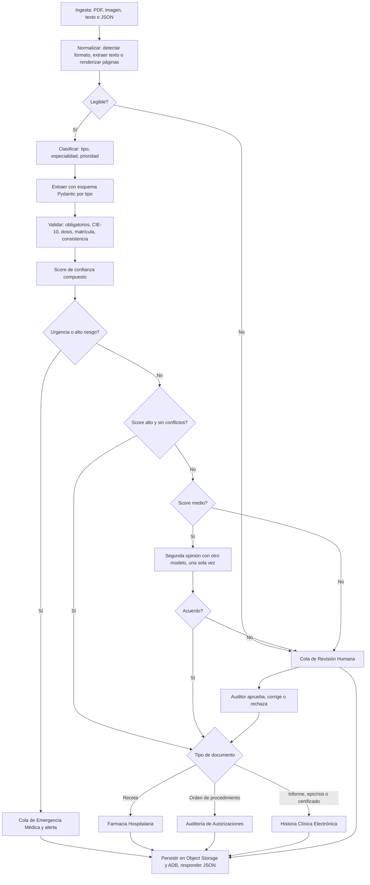

# MediFlow · Plan del sistema y del equipo

**Hackathon ONE G10 · Oracle Next Education & Alura**
**Equipo:** 8 personas (5 AI/LLM Engineers, 1 Full Stack Developer, 1 Backend Developer, 1 Data Scientist)
**Inicio:** martes 15 de septiembre de 2026 · **Entrega interna:** miércoles 14 de octubre · **Límite de la plataforma:** 27 de octubre
**Regla del programa:** solo recursos Always Free de OCI. Sin trial, sin Pay As You Go, sin OCI Generative AI. El LLM viene de un proveedor externo con capa gratuita.

Este documento habla de roles y tareas. Los nombres se asignan en el kickoff.

---

## 0. MediFlow en una frase

Recibe documentos clínicos en PDF, imagen, texto o JSON, los clasifica, extrae los datos con un LLM multimodal, calcula un score de confianza, detecta urgencias y los enruta al destino correcto. Lo ambiguo o ilegible va a un auditor humano. Todo se persiste en OCI Object Storage, el historial vive en Autonomous AI Database, y el sistema completo corre en la capa Always Free de OCI.

---

## 1. Qué pide el proyecto, cómo lo cumplimos y cuál es el plus

### 1.1 Checklist de evaluación (obligatorio)

| # | Requisito del brief | Cómo lo cumplimos (MVP) | Plus |
|---|---|---|---|
| 1 | Ingesta funcional en texto, PDF o imagen | `POST /triage` con el JSON del brief y con archivos, pantalla de carga en Streamlit, y carpeta `recibidos/` del bucket que un worker procesa sola | Detección automática de formato (PDF con texto, PDF escaneado, foto, JSON), duplicados por hash, separación de un PDF con varios documentos |
| 2 | Clasificación automática con LLM multimodal | Nodo de clasificación con Gemini: los 5 tipos del brief más "otro", especialidad y prioridad en la misma pasada | Segunda opinión con otro modelo cuando la confianza es media |
| 3 | Extracción precisa en JSON estructurado | Un esquema Pydantic por tipo de documento, salida validada, CIE-10 sugerido, contrato idéntico al ejemplo del brief | Evidencia por campo: cada dato cita el fragmento y la página del documento que lo sustenta |
| 4 | Lógica de decisión condicional con ambiguos y urgentes | Grafo LangGraph con aristas condicionales: normalizar, clasificar, extraer, validar, puntuar, detectar urgencia, enrutar | Score compuesto calibrado, umbrales editables sin código, política "urgencia primero" con recall 100 % en el golden set |
| 5 | Integración activa con OCI Object Storage Always Free | Bucket privado segregado por estado: `recibidos/`, `procesados/{destino}/`, `auditoria_humana/`, `rechazados/` | `reportes/` con el informe diario, acceso por instance principal sin claves en el código, historial consultable en Autonomous AI Database y dashboard APEX |
| 6 | Demostración de 3 escenarios: rutina, urgencia, ambiguo | Los tres casos con datos sintéticos, reproducibles desde la URL pública y grabados en el video | Dos escenarios extra: receta de alto riesgo farmacológico y el reporte diario llegando al correo del gestor |
| 7 | Documentación completa con diagrama del flujo del agente | README con arquitectura, diagrama Mermaid del grafo, instrucciones de ejecución y los escenarios | Resultados de evaluación con números, decisiones y trade-offs registrados en ADRs |

### 1.2 Diferenciales que el brief nombra (hacemos los cinco)

| Diferencial | Cómo |
|---|---|
| Flujo clínico personalizable por el usuario | Reglas en Autonomous AI Database (umbrales, destinos, hallazgos críticos, medicamentos de alto riesgo) editables desde la página "Reglas" de la UI. El grafo las lee en cada ejecución. |
| Despliegue completo en OCI Compute | VM Ampere A1 Always Free con Docker Compose, Nginx y TLS, URL pública. |
| OCR y visión multimodal | PDF escaneado y fotos de recetas manuscritas van directo al modelo multimodal, con una puerta de legibilidad antes. |
| Panel de auditoría Human-in-the-Loop en Streamlit | Cola de auditoría con documento y JSON lado a lado: aprobar, corregir o rechazar con un clic. La corrección reencamina el documento. |
| Alertas en tiempo real | OCI Notifications (Always Free) a email y Slack cuando hay urgencia o alto riesgo. n8n en la VM solo si los mentores lo valoran. |

### 1.3 Nuestros plus más allá del brief

| Plus | Por qué gana | Prioridad |
|---|---|---|
| Reporte diario y semanal al gestor, redactado por el agente | KPIs del día más un resumen ejecutivo y recomendaciones, por email vía OCI Email Delivery, guardado en `reportes/`. Habla el idioma del gestor hospitalario, no solo del auditor | Obligatorio |
| Evaluación con números y calibración del score | Accuracy, precisión y recall por campo, recall de urgencias, tasa de revisión humana, diagrama de calibración. Demuestra que cuando el score es bajo el error es real | Obligatorio |
| Trazabilidad "ver pensar al agente" | Panel con cada nodo del grafo, tiempo, modelo, costo y justificación | Obligatorio |
| Privacidad por diseño | Datos 100 % sintéticos, bucket privado, PII fuera de logs y reportes, secretos en OCI Vault | Obligatorio |
| Resiliencia con respaldo de modelos | Dos modelos de respaldo por tipo de entrada (Gemini → Groq → Mistral), cambio automático ante 429, 5xx o timeout, y demostrado en vivo en el video con la clave de Gemini desactivada | Obligatorio |
| Segunda opinión entre modelos | Con score medio, un segundo modelo extrae y se compara. Acuerdo sube el score, desacuerdo manda a auditoría | Sprint 3 si va en tiempo |
| Aprendizaje desde la auditoría | Cada corrección del auditor se guarda como ejemplo few-shot y como test de regresión | Sprint 3 si va en tiempo |
| Multilingüe ES, PT y EN | Documentos en español, portugués e inglés, un solo esquema de salida. Esfuerzo bajo: ejemplos en cada idioma en el golden set y una instrucción en el prompt | Sprint 3 si va en tiempo |
| Infraestructura como código | Terraform con OCI Resource Manager, todo Always Free reproducible en minutos | Sprint 4, stretch |
| Separación de varios documentos en un PDF | Triaje individual por documento | Stretch |

Regla de alcance: el checklist, los cinco diferenciales del brief y los cinco plus obligatorios son el proyecto. El resto entra solo si el sprint 3 cierra en fecha.

---

## 2. Arquitectura del sistema

### 2.1 Componentes

| Componente | Tecnología | Notas |
|---|---|---|
| LLM multimodal | Gemini en capa gratuita (Flash para volumen, Pro para casos difíciles) como principal. Respaldos con capa gratuita y visión: Groq (Llama 4 Scout) y Mistral Small. Adaptador único (LiteLLM o propio) con cambio automático ante 429, 5xx o timeout | Los límites gratuitos son por proyecto o cuenta y son bajos por minuto y por día: un proyecto de Google por desarrollador, uno reservado para demo y evaluaciones, cola con reintentos y backoff, caché por hash de documento. Cada resultado registra qué modelo lo procesó. Tabla completa de respaldos por tipo de entrada en la sección 14 |
| Orquestación | LangGraph en Python | Grafo con nodos y aristas condicionales, estado tipado con Pydantic |
| API | FastAPI | `POST /triage`, `GET /triage/{id}`, `GET /queue/human`, `POST /audit/{id}`, `GET /rules`, `PUT /rules`, `GET /metrics` |
| UI | Streamlit multipágina: Carga, Cola de triaje, Auditoría, Reglas, Métricas, Trazas | Rápida y nombrada en el brief. Next.js solo si el Full Stack se compromete con la misma fecha |
| Documentos | OCI Object Storage (obligatorio) | Layout en 2.6 |
| Historial y reglas | Autonomous AI Database 26ai Always Free | Tablas `documents`, `triage_results`, `audit_decisions`, `rules`, `metrics_daily`. APEX para el dashboard |
| Alertas y reportes | OCI Notifications y OCI Email Delivery | Topic `mediflow-urgencias` con suscripciones email y Slack. Reporte diario por email |
| Cómputo | VM Ampere A1 Always Free (2 OCPU, 12 GB) | Docker Compose: `nginx`, `api`, `ui`, `worker` |
| Secretos | OCI Vault e instance principal | Sin claves de OCI en el código. Claves del LLM en Vault |
| PDF e imagen | PyMuPDF (texto y render de páginas), Pillow, heurística de legibilidad | El OCR lo hace el modelo multimodal. Tesseract solo como respaldo |
| CI/CD | GitHub Actions → SSH a la VM → `git pull` y `docker compose up -d --build` | Cada merge a `main` despliega. Evaluaciones en CI cuando cambian prompts o grafo. Detalle completo en la sección 11 |

### 2.2 Grafo de decisión



Una urgencia con score bajo va a Emergencia y además queda marcada para auditoría. Un falso positivo de urgencia cuesta minutos de un médico; un falso negativo cuesta un paciente.

### 2.3 Score de confianza

`score = 0.25 legibilidad + 0.30 validación + 0.25 confianza declarada por el modelo + 0.20 acuerdo entre modelos`

| Rango | Acción |
|---|---|
| ≥ 0.85 | Enrutamiento automático |
| 0.60 a 0.85 | Segunda opinión con otro modelo, luego se decide |
| < 0.60 | Revisión humana |
| Cualquier conflicto (diagnóstico vs estudio, dosis fuera de rango, paciente sin identificación) | Revisión humana sin importar el score |
| Urgencia detectada | Emergencia siempre |

Los pesos y umbrales son valores iniciales. Se calibran con el golden set en el sprint 3 y viven en la tabla `rules`, editables desde la UI.

### 2.4 Urgencia y alto riesgo

- Hallazgos críticos en una lista determinística (TEP, IAM, ACV, sepsis, neumotórax a tensión, hemorragia activa, hiperpotasemia severa) más palabras clave ("urgente", "inmediato", "crítico") más el juicio del LLM con justificación. Basta con que una de las tres fuentes dispare.
- Alto riesgo farmacológico: opioides, anticoagulantes, insulina, quimioterapia, dosis pediátricas. Van a Farmacia con auditoría obligatoria.
- Las dos listas se editan desde la UI.

### 2.5 Datos ilegibles, incompletos o inconsistentes

| Caso | Qué hace el sistema |
|---|---|
| PDF sin capa de texto | Renderiza las páginas a imagen y las envía al modelo multimodal |
| Foto borrosa, oscura o inclinada | Score de legibilidad (resolución, contraste, nitidez y autoevaluación del modelo). Bajo el umbral va a revisión humana con motivo "ilegible, solicitar nueva captura" |
| Receta manuscrita | Modelo multimodal más segunda opinión. Los medicamentos con confianza baja se marcan campo por campo |
| JSON incompleto o inválido | Validación Pydantic con errores explícitos en la respuesta. Sin identificación del paciente va a revisión humana |
| Datos contradictorios (edad vs fecha de nacimiento, diagnóstico vs estudio) | Conflicto detectado, revisión humana con el detalle |
| Varios documentos en un PDF | Separación por página y triaje individual (stretch) |
| Proveedor LLM caído o con límite de cuota | Reintento con backoff, cambio al modelo de respaldo, si no, cola "pendiente" y reintento. El documento nunca se pierde porque ya está en `recibidos/` |

### 2.6 Layout de Object Storage

```
mediflow-documentos-clinicos/
  recibidos/{documento_id}.{pdf|png|jpg|txt|json}
  procesados/urgentes/{documento_id}.json
  procesados/farmacia/{documento_id}.json
  procesados/autorizaciones/{documento_id}.json
  procesados/historia_clinica/{documento_id}.json
  auditoria_humana/{documento_id}/original.{ext}
  auditoria_humana/{documento_id}/extraccion.json
  rechazados/{documento_id}.json
  reportes/diario/{fecha}.json
  reportes/diario/{fecha}.md
```

Cada JSON de resultado sigue el contrato del brief (`status`, `clasificacion`, `datos_extraidos`, `decision_enrutamiento`, `almacenamiento_oci`) más `trace` y `evidencias`.

### 2.7 Reporte diario y semanal al gestor

- Job programado en la VM a las 07:00 que consulta ADB: volumen por tipo y destino, urgencias detectadas, tiempo medio de triaje, tasa de revisión humana, pendientes en la cola, confianza media, documentos rechazados.
- Un nodo LLM redacta un resumen ejecutivo de cinco líneas y tres recomendaciones, por ejemplo "la cola de auditoría creció 40 %, asignar un auditor más el lunes".
- Se envía por OCI Email Delivery y se guarda en `reportes/`. La versión semanal agrega tendencias. Solo datos agregados, nunca datos de pacientes.

### 2.8 Evaluación

- Golden set: 60 documentos sintéticos (12 por tipo), 40 % en portugués, con 20 variantes degradadas (escaneo con ruido, foto inclinada, manuscrita simulada, campos faltantes, datos contradictorios). Etiquetas: tipo, entidades, prioridad, destino esperado, requiere auditoría.
- Métricas: accuracy de clasificación, precisión y recall por campo, recall de urgencias con objetivo 100 %, tasa de revisión humana, latencia, costo por documento, calibración del score.
- Corre en CI en cada PR que toque prompts o el grafo. Resultados en el README y en APEX.

---

## 3. Equipos por rol

| Squad | Roles | Responsabilidad |
|---|---|---|
| Agente | LLM Engineer y 2 AI Engineers (A y B) | Grafo LangGraph, prompts, esquemas Pydantic, score, urgencia, segunda opinión, motor de reglas |
| Plataforma | Backend Developer, Full Stack Developer y 1 AI Engineer (C) | OCI (bucket, VM, ADB, Vault, Notifications, Email), API, UI, panel de auditoría, worker del bucket, CI/CD |
| Datos y Calidad | Data Scientist y 1 AI Engineer (D) | Dataset sintético y golden set, evaluación y calibración, dashboard APEX, reporte diario, documentación y video |

Roles transversales (una persona cada uno, se asignan en el kickoff): Product Owner (brief, alcance, Inbox, planificación), Tech Lead (arquitectura, última palabra técnica), Demo Owner (UI y video), Release Manager (`main`, despliegues, cuenta OCI y secretos).

---

## 4. Hitos

| Fecha | Hito |
|---|---|
| Mar 15 sep | Kickoff. Cuenta OCI, repo y tablero creados. Preguntas a los mentores por el Inbox. |
| Jue 17 sep | Brief y alcance aprobados. Decisiones: LangGraph, Streamlit, modelo principal y de respaldo. Contrato JSON y esquemas Pydantic congelados. |
| Dom 20 sep | Fundaciones: bucket con prefijos, VM con URL pública, ADB, `POST /triage` stub desplegado, golden set v0. |
| Dom 27 sep | Base de punta a punta: texto, PDF e imagen entran y sale el JSON del brief en la carpeta correcta del bucket. Los 3 escenarios reproducibles. |
| Dom 4 oct | Diferenciales listos: panel de auditoría, reglas editables, alertas, visión multimodal, reporte diario. Congelamiento de funcionalidades. |
| Sáb 10 oct | Ensayo general con alguien externo. |
| Dom 11 oct | Cero bugs P1. Evaluaciones finales en el README. |
| Lun 12 oct | Grabación del video. |
| Mié 14 oct | Entrega de las 4 tareas en la plataforma. |

---

## 5. Sprint 1 · Fundaciones · martes 15 a domingo 20 de septiembre

Objetivo: congelar contratos y dejar la infraestructura Always Free lista. Cada fila es una issue del tablero.

| ID | Tarea | Rol | Listo cuando |
|---|---|---|---|
| A1 | Decidir orquestación: LangGraph vs n8n. Recomendación LangGraph. Registrar en `docs/decisions.md` | Tech Lead | Jue 17 |
| A2 | Congelar el contrato JSON de entrada y salida según el ejemplo del brief. Publicar como JSON Schema en `docs/contracts/` | LLM Engineer | Jue 17 |
| A3 | Esquemas Pydantic: Receta, Informe de Estudio, Orden de Procedimiento, Epicrisis, Certificado, más el esquema común de paciente y profesional | AI Engineer A | Vie 18 |
| A4 | Spike multimodal: un PDF nativo, un PDF escaneado y una foto de receta manuscrita contra Gemini Flash, Gemini Pro y un modelo de respaldo. Medir campos correctos y latencia. Elegir principal y respaldo | AI Engineer B | Jue 17 |
| A5 | Grafo v0: diagrama Mermaid con nodos y aristas condicionales, estado tipado, esqueleto LangGraph con nodos stub que devuelven el JSON de ejemplo | LLM Engineer | Dom 20 |
| A6 | Taxonomía de destinos y reglas iniciales en YAML versionado: hallazgos críticos, medicamentos de alto riesgo, umbrales por defecto | AI Engineer A | Dom 20 |
| A7 | Prompts v0 de clasificación y extracción con salida JSON estricta, probados contra 5 documentos del golden set | AI Engineer B | Dom 20 |
| P1 | Cuenta OCI, región, compartment `mediflow`, grupo IAM con 8 usuarios, políticas mínimas | Release Manager | Mar 15 |
| P2 | Bucket `mediflow-documentos-clinicos` privado con todos los prefijos de 2.6. Script de subida, lectura y listado con el SDK | Backend Developer | Mié 16 |
| P3 | VM Ampere A1 Always Free, Docker Compose, Nginx, TLS, dominio. Instance principal con política para Object Storage y Vault | Release Manager | Jue 17 |
| P4 | Autonomous AI Database Always Free 26ai, wallet, usuario de aplicación, tablas v0 | Backend Developer | Vie 18 |
| P5 | OCI Vault con la clave del LLM, leída desde la API en el arranque | Backend Developer | Vie 18 |
| P6 | Monorepo, CI con lint y tests, CODEOWNERS, plantilla de PR, tablero con estas issues | AI Engineer C | Mar 15 |
| P7 | FastAPI: `POST /triage` que valida la entrada del brief y devuelve el JSON de ejemplo, `GET /health`. Desplegado por CI a la URL pública | AI Engineer C | Dom 20 |
| P8 | Streamlit v0: página de carga (texto, PDF, imagen, JSON) que llama a `/triage` y muestra el JSON | Full Stack Developer | Dom 20 |
| P9 | Topic de OCI Notifications `mediflow-urgencias` con suscripción por email. Publicación de prueba desde la VM | Full Stack Developer | Dom 20 |
| D1 | Brief del producto y alcance del MVP con líneas de corte. Preguntas a los mentores por el Inbox: destinos reales, umbrales, idiomas, formatos | Product Owner | Jue 17 |
| D2 | Generador de documentos sintéticos: 30 documentos (6 por tipo) en español y portugués con plantillas realistas de hospital, matrícula y CIE-10 | Data Scientist | Vie 18 |
| D3 | Variantes degradadas: 10 escaneos con ruido, fotos inclinadas, una receta manuscrita simulada, 3 con datos faltantes o contradictorios | AI Engineer D | Dom 20 |
| D4 | Golden set v0 etiquetado en JSONL en `/evals`: tipo, entidades esperadas, prioridad, destino, requiere auditoría | Data Scientist | Dom 20 |
| D5 | Métricas y umbrales objetivo definidos. Esqueleto del harness: carga el golden set, llama a `/triage`, compara | AI Engineer D | Dom 20 |
| D6 | Esquema de tablas en ADB: `documents`, `triage_results`, `audit_decisions`, `rules`, `metrics_daily` (con P4) | Data Scientist | Vie 18 |
| D7 | README esqueleto (Tarea 1), Tarea 3 herramientas, Tarea 4 enlaces | Product Owner | Dom 20 |
| D8 | Descarga y preparación de CodiEsp y MEDDOCAN: 40 casos elegidos, convertidos al formato de entrada, con licencia y cita en `evals/DATA.md` | AI Engineer D | Vie 18 |
| D9 | Protocolo de recetas manuscritas: cada persona escribe a mano dos recetas ficticias con el guion de la sección 13 y sube las fotos a `evals/handwritten/` | Todo el equipo | Dom 20 |

**Criterio de cierre (domingo 20):** `POST /triage` responde el JSON del brief desde la URL pública. Un archivo subido desde la VM aparece en `recibidos/`. Una llamada multimodal funciona desde la VM. Grafo v0 con nodos stub en `main`. Golden set v0 con 40 documentos en `/evals`. Esquemas Pydantic en `main`. Brief aprobado.

---

## 6. Sprints 2 a 4 y cierre

### Sprint 2 · La base · lunes 21 a domingo 27 de septiembre

| Squad | Tareas |
|---|---|
| Agente | Nodos reales: normalizar, clasificar, extraer, validar, puntuar, detectar urgencia, enrutar. Primero texto y PDF nativo, luego PDF escaneado e imagen vía multimodal. Salida idéntica al contrato. Trace por nodo. |
| Plataforma | Persistencia en el bucket por estado. `triage_results` en ADB. Worker con cola, reintentos y backoff para los límites del proveedor. `GET /triage/{id}`. UI: resultado con clasificación, datos, decisión y ruta en el bucket. Worker que procesa `recibidos/`. |
| Datos y Calidad | Harness v0 sobre el golden set: accuracy, precisión y recall por campo, recall de urgencias. Primeras cifras. Ajuste de prompts con el squad Agente. Los 3 escenarios documentados. |

**Criterio de cierre (domingo 27):** los 3 escenarios del brief funcionan desde la URL pública y quedan en la carpeta correcta del bucket. Primer número de accuracy en el README.

### Sprint 3 · Los diferenciales · lunes 28 de septiembre a domingo 4 de octubre

| Squad | Tareas |
|---|---|
| Agente | Adaptador de modelos con respaldo automático Gemini → Groq → Mistral, registrado en la traza. Score compuesto calibrado. Segunda opinión con otro modelo. Reglas leídas desde ADB. Alto riesgo farmacológico. Evidencia por campo. Español, portugués e inglés. |
| Plataforma | Panel de auditoría: aprobar, corregir, rechazar, reencaminar. Página de reglas: umbrales, destinos, listas. Alertas por OCI Notifications en urgencias. Panel de trazas. Dashboard APEX con Datos y Calidad. |
| Datos y Calidad | Reporte diario v1: job, KPIs, narrativa, email, `reportes/`. Calibración del score. Evaluaciones en CI. README con resultados. Guion del video. |

**Criterio de cierre (domingo 4, 23:59):** los cinco diferenciales del brief funcionan, el reporte diario llega por email y el respaldo de modelos se activa solo al desactivar la clave de Gemini. Congelamiento de funcionalidades.

### Sprint 4 · Endurecimiento · lunes 5 a domingo 11 de octubre

| Squad | Tareas |
|---|---|
| Agente | Casos borde: documento vacío, archivo equivocado, PDF de 40 páginas, dos documentos en uno, foto ilegible, JSON sin paciente. Fallbacks cuando el proveedor falla. Tests de regresión con las correcciones de auditoría. |
| Plataforma | Cacería de bugs martes 6 y miércoles 7. Checklist de privacidad: PII fuera de logs, bucket privado, secretos en Vault. Datos semilla para la demo. Terraform con Resource Manager (stretch). |
| Datos y Calidad | Evaluación final con los tres modelos (Gemini, Groq, Mistral) y diagrama de calibración. Reporte semanal. README completo con diagrama final y ficha de datos. Storyboard del video. Tareas 1 a 4 actualizadas. |

**Criterio de cierre (domingo 11):** cero bugs P1. Ensayo general con alguien externo el sábado 10. Nada corre en localhost.

### Cierre · lunes 12 a miércoles 14 de octubre

| Día | Tareas |
|---|---|
| Lun 12 | Grabación del video, dos tomas. El Demo Owner presenta, el Data Scientist cubre resultados. |
| Mar 13 | Edición y subida a YouTube. README final. Todos los enlaces probados desde una ventana de incógnito. |
| Mié 14 | Entrega de las 4 tareas en la plataforma. Jueves 15 es buffer. |

---

## 7. Guion de la demo (5 minutos)

1. Rutina: certificado médico en PDF. Clasificado, extraído, enrutado a Historia Clínica. Se muestra el JSON y el objeto en `procesados/historia_clinica/`.
2. Urgencia: el informe de TEP del brief. Emergencia Médica, alerta por email y Slack en pantalla, objeto en `procesados/urgentes/`.
3. Ambiguo: foto de una receta manuscrita con dosis dudosa. Score bajo, revisión humana. El auditor corrige la dosis en el panel y el documento se reencamina a Farmacia.
4. Alto riesgo: receta con anticoagulante. Farmacia con auditoría obligatoria, sin intervención del usuario.
5. Resiliencia: se desactiva la clave de Gemini en la página de reglas, se sube un informe escaneado, y el panel de trazas muestra el error 401, el cambio a Groq y el resultado correcto. Un minuto que dice "esto no se cae".
6. El gestor: el reporte diario en la bandeja de entrada y el dashboard APEX con las métricas, la calibración y la precisión de cada modelo.

Cierre con el diagrama del grafo y los números de evaluación. Cada escena dura menos de un minuto; se ensaya con cronómetro el sábado 10.

---

## 8. Rituales y reglas de trabajo

| Ritual | Cuándo | Formato |
|---|---|---|
| Kickoff | Martes 15 (miércoles 16 si no hay quórum) | 2 h con cámaras: brief, roles, decisiones técnicas, ventana horaria común |
| Standup asíncrono | Todos los días antes de una hora fija | 3 líneas en el chat: ayer, hoy, bloqueos |
| Planificación | Lunes | 45 min |
| Bloqueos | Jueves | 30 min |
| Demo del sprint | Viernes | 30 min, luego se actualizan las Tareas 1 a 4 en la plataforma |
| Decisiones | El mismo día | Una entrada en `docs/decisions.md` |

Definición de hecho: código en `main` vía PR revisado, desplegado en OCI, con prueba mínima, y documentado en el README si cambia el comportamiento visible.

GitHub: un monorepo (`/agent`, `/api`, `/ui`, `/worker`, `/evals`, `/infra`, `/docs`), `main` protegida con PR, una aprobación y CI en verde, ramas cortas mergeadas en 2 o 3 días, tablero con dueño, squad y sprint por issue, CODEOWNERS por carpeta, `.env.example` en el repo y credenciales solo en OCI Vault y GitHub Secrets. Políticas, workflows y orden de montaje en la sección 11.

---

## 9. Riesgos

| Riesgo | Mitigación |
|---|---|
| Límites de la capa gratuita del LLM (pocas solicitudes por minuto y por día, por proyecto) | Un proyecto de Google Cloud por desarrollador y uno reservado para demo y evaluaciones. Cola con backoff. Caché por hash. Modelo de respaldo. |
| Proveedor LLM caído durante la demo | Video grabado con anticipación. Segundo proveedor configurado. Resultados del golden set cacheados. |
| Datos de pacientes reales | Prohibido. Solo datos sintéticos. Checklist de privacidad en el sprint 4. |
| Recall de urgencias menor a 100 % | Lista determinística de hallazgos críticos además del LLM. Tests de regresión en CI. |
| Sin capacidad para VMs Ampere A1 | Crear la VM el día 1. Reintentar en otro availability domain. |
| Salirse de Always Free | Solo Object Storage, Compute A1, Autonomous AI Database, APEX, Vault, Notifications, Email Delivery, Resource Manager. Revisión de costos en cada demo de viernes. |
| Alcance | Checklist, cinco diferenciales del brief y cuatro plus obligatorios. El resto solo si el sprint 3 cierra en fecha. |

---

## 10. Checklist de arranque, hoy martes 15

- [ ] El Release Manager crea la cuenta OCI y agrega a los 8 usuarios (P1, orden de montaje en 11.7).
- [ ] El AI Engineer C crea el repo, el CI y el tablero y carga las issues de este documento (P6).
- [ ] Cada desarrollador crea su proyecto de Google Cloud y su clave de Gemini en Google AI Studio.
- [ ] El Product Owner envía las preguntas a los mentores por el Inbox (D1).
- [ ] Todos confirman la ventana horaria común y la hora del standup.
- [ ] Se agenda el kickoff y se asignan los roles transversales.

---

## 11. Cómo trabajamos juntos: cuenta OCI, GitHub y despliegue

Principio: una sola cuenta de OCI para el proyecto con ocho usuarios, un solo repositorio en GitHub, y despliegues que hace el CI. Nadie envía código a nadie y nadie despliega a mano.

### 11.1 La cuenta OCI: una tenancy, ocho usuarios

| Qué | Cómo |
|---|---|
| Quién la abre | El Release Manager, con su tarjeta y su teléfono. No se cobra nada mientras nadie haga upgrade, y el programa exige quedarse en Always Free. |
| Región | Cualquiera con Always Free. Se elige al crear la cuenta y no se cambia. |
| Compartment | `mediflow`. Todo el proyecto vive ahí, nada en la raíz. |
| Grupos | `mediflow-admins` con dos personas (Release Manager y Tech Lead) y `mediflow-devs` con las ocho. Dos administradores para que la cuenta no dependa de una sola persona. |
| Usuarios | Identity & Security → Domains → Default → Users → Create user, uno por persona con su email. Cada uno activa MFA y genera su propia API key (Perfil → API keys → Add API key). El archivo `~/.oci/config` es personal y no se comparte. |
| Contraseña del dueño | No se comparte nunca. Ni por chat, ni por Bitwarden. |
| Dynamic group | `mediflow-vm` con la regla `Any {instance.compartment.id = '<OCID del compartment mediflow>'}` para que la VM use instance principal. |
| Recursos dev y prod | Bases: `mediflow-dev` y `mediflow-prod` (las dos Always Free). Buckets: `mediflow-dev` y `mediflow-documentos-clinicos`. Una sola VM, la de producción. El desarrollo diario corre en la laptop de cada uno. |
| Email Delivery | Las credenciales SMTP se generan sobre un usuario técnico y se guardan en Vault. |

Políticas, en Identity & Security → Policies, creadas en el compartment raíz:

```
Allow group mediflow-admins to manage all-resources in compartment mediflow
Allow group mediflow-devs to manage object-family in compartment mediflow
Allow group mediflow-devs to use autonomous-databases in compartment mediflow
Allow group mediflow-devs to read secret-family in compartment mediflow
Allow group mediflow-devs to read instances in compartment mediflow
Allow dynamic-group mediflow-vm to manage objects in compartment mediflow
Allow dynamic-group mediflow-vm to read secret-family in compartment mediflow
Allow dynamic-group mediflow-vm to use ons-topics in compartment mediflow
```

Opcional: quien quiera puede abrir su propia cuenta Always Free personal para spikes y aprendizaje. El proyecto vive en una sola.

### 11.2 El repositorio: uno solo, ningún archivo por chat

- Organización gratuita en GitHub, `mediflow-one-g10`, con las ocho personas como miembros y tres equipos: `agente`, `plataforma`, `datos`. Así el repo no depende de la cuenta personal de nadie y la URL se ve profesional.
- Repo público. El jurado y los reclutadores lo necesitan, y además la VM hace `git pull` sin credenciales. Si se decide privado, la VM usa una deploy key de solo lectura.
- Estructura del monorepo:

```
mediflow/
  agent/        grafo LangGraph, prompts, esquemas Pydantic, reglas
  api/          FastAPI
  ui/           Streamlit
  worker/       procesa recibidos/, cola, reintentos, reporte diario
  evals/        golden set, harness, reportes de evaluación
  infra/        docker-compose.yml, nginx.conf, terraform/
  docs/         README extendido, architecture.md, decisions.md, contracts/
  .github/      workflows, CODEOWNERS, plantilla de PR
  .env.example
  docker-compose.dev.yml
```

- Flujo de una tarea, siempre el mismo:
  1. Tomar una issue del tablero y asignársela.
  2. Crear la rama `feat/<squad>-<tema>` o `fix/<squad>-<tema>` desde `main`.
  3. Commits pequeños con mensaje claro.
  4. Abrir el PR con la plantilla. El CI corre lint y tests.
  5. Una aprobación del squad dueño de la carpeta (CODEOWNERS lo asigna solo).
  6. Squash merge. El CI despliega a la VM.
  7. Mover la issue a Hecho.

- `.github/CODEOWNERS`:

```
/agent/   @mediflow-one-g10/agente
/api/     @mediflow-one-g10/plataforma
/ui/      @mediflow-one-g10/plataforma
/worker/  @mediflow-one-g10/plataforma
/infra/   @mediflow-one-g10/plataforma
/evals/   @mediflow-one-g10/datos
/docs/    @mediflow-one-g10/datos
```

- `.github/pull_request_template.md`:

```
## Qué cambia

## Cómo probarlo

## Issue
Closes #

## Checklist
- [ ] Tests pasan en local
- [ ] Sin claves, wallets ni datos de pacientes en el código
- [ ] README o docs actualizados si cambia algo visible
```

- Protección de `main`: Settings → Branches → Add rule: PR obligatorio, una aprobación, CI en verde como status check, sin force push.

### 11.3 El despliegue: lo hace GitHub Actions

Dos workflows. `ci.yml` corre en cada PR. `deploy.yml` corre en cada merge a `main`, entra por SSH a la VM y la VM hace `git pull` y `docker compose up -d --build`. Se construye en la VM porque es ARM (Ampere) y así no hay que compilar imágenes ARM en GitHub ni mantener un registro. OCIR queda como mejora opcional.

`.github/workflows/ci.yml`:

```yaml
name: CI
on:
  pull_request:
    branches: [main]
jobs:
  test:
    runs-on: ubuntu-latest
    steps:
      - uses: actions/checkout@v4
      - uses: actions/setup-python@v5
        with:
          python-version: "3.12"
      - run: pip install -r requirements-dev.txt
      - run: ruff check .
      - run: pytest -q
  evals:
    if: contains(github.event.pull_request.labels.*.name, 'evals')
    runs-on: ubuntu-latest
    steps:
      - uses: actions/checkout@v4
      - uses: actions/setup-python@v5
        with:
          python-version: "3.12"
      - run: pip install -r requirements-dev.txt
      - run: python evals/run.py --golden evals/golden_v0.jsonl --report evals/report.md
        env:
          GEMINI_API_KEY: ${{ secrets.GEMINI_API_KEY_EVALS }}
```

El job `evals` solo corre cuando el PR lleva la etiqueta `evals`, para no gastar la cuota gratuita en cada cambio. Se etiqueta todo PR que toque `agent/`.

`.github/workflows/deploy.yml`:

```yaml
name: Deploy
on:
  push:
    branches: [main]
concurrency: deploy-prod
jobs:
  deploy:
    runs-on: ubuntu-latest
    steps:
      - uses: appleboy/ssh-action@v1
        with:
          host: ${{ secrets.VM_HOST }}
          username: ${{ secrets.VM_USER }}
          key: ${{ secrets.VM_SSH_KEY }}
          script: |
            set -e
            cd /opt/mediflow
            git fetch origin main
            git reset --hard origin/main
            docker compose -f infra/docker-compose.yml up -d --build --remove-orphans
            docker image prune -f
            sleep 10
            curl -fsS https://${{ secrets.APP_DOMAIN }}/health
```

`infra/docker-compose.yml`:

```yaml
services:
  nginx:
    image: nginx:stable
    ports: ["80:80", "443:443"]
    volumes:
      - ./nginx.conf:/etc/nginx/conf.d/default.conf:ro
      - /etc/letsencrypt:/etc/letsencrypt:ro
    depends_on: [api, ui]
    restart: unless-stopped
  api:
    build: ../api
    env_file: ../.env
    volumes:
      - ../wallet:/app/wallet:ro
    restart: unless-stopped
  ui:
    build: ../ui
    env_file: ../.env
    restart: unless-stopped
  worker:
    build: ../worker
    env_file: ../.env
    volumes:
      - ../wallet:/app/wallet:ro
    restart: unless-stopped
```

Secretos de GitHub (Settings → Secrets and variables → Actions):

| Secreto | Valor |
|---|---|
| `VM_HOST` | IP pública de la VM |
| `VM_USER` | `opc` en Oracle Linux, `ubuntu` en Ubuntu |
| `VM_SSH_KEY` | Llave privada creada solo para el despliegue. La pública va en `~/.ssh/authorized_keys` de la VM |
| `APP_DOMAIN` | Dominio de la app |
| `GEMINI_API_KEY_EVALS` | Clave del proyecto de Google reservado para evaluaciones |

Preparación de la VM, una sola vez, por el Release Manager: instalar Docker y git, clonar el repo en `/opt/mediflow`, crear `/opt/mediflow/.env` con la configuración no secreta (región, nombre del bucket, DSN de la base, OCID del secreto de Gemini en Vault, `ENV=prod`), copiar el wallet de la base a `/opt/mediflow/wallet/` fuera de git, dominio gratuito (DuckDNS) y certificado con certbot, y abrir los puertos 80 y 443 en la security list de la subred y en el firewall de la VM.

Secretos en ejecución: la aplicación lee la clave de Gemini desde OCI Vault usando instance principal al arrancar. En el repo y en la VM no hay ninguna clave escrita. Solo el Release Manager entra por SSH, y solo para incidentes.

### 11.4 Desarrollo local

- Cada dev levanta `api`, `ui` y `worker` con `docker compose -f docker-compose.dev.yml up`, apuntando al bucket y la base `mediflow-dev` con su `~/.oci/config` y su clave de Gemini en un `.env` local que nunca entra a git. `.env.example` en el repo documenta cada variable.
- Cada dev tiene su propio proyecto de Google Cloud y su propia clave, porque los límites de la capa gratuita son por proyecto.
- El wallet de `mediflow-dev` se comparte por Bitwarden (gratis), nunca por chat.
- Antes de abrir un PR que toque prompts o el grafo, se corre el harness localmente contra el golden set.

### 11.5 Entregables de la plataforma

Las Tareas 1 a 4 las actualiza una sola persona, el Product Owner, cada viernes después de la demo. La fuente es el README del repo, no un documento aparte. Aunque la plataforma deje editar a todos, una sola mano evita que se pisen.

### 11.6 Lo que no se hace

- Compartir la contraseña del dueño de la cuenta.
- Mandar código por WhatsApp, Drive o ZIP.
- Editar directo en `main` o desplegar a mano.
- Guardar claves, wallets o datos de pacientes en el repo.
- Trabajar dos personas en el mismo archivo sin una issue asignada.

### 11.7 Orden de montaje el día 1 (Release Manager)

1. Cuenta OCI, región y compartment `mediflow`.
2. Grupos, usuarios, políticas y dynamic group.
3. Buckets, las dos bases, Vault con el secreto de Gemini.
4. VM, Docker, dominio y TLS.
5. Organización y repo en GitHub, equipos, protección de `main`, secretos, CODEOWNERS y plantilla de PR.
6. Primer despliegue: `/health` responde desde la URL pública.

---

## 12. Herramientas y costo cero

| Herramienta | Costo | Cómo la usamos |
|---|---|---|
| LangGraph | Gratis, librería open source (MIT). Lo pago es LangGraph Platform y los planes altos de LangSmith, que no necesitamos | El grafo corre dentro de nuestra API en la VM. Las trazas las guardamos nosotros en la base |
| n8n | Gratis auto-hospedado en nuestra VM (licencia fair-code para uso interno). Lo pago es n8n Cloud | Opcional. Un solo workflow visible: webhook → Slack y correo. Nunca el núcleo del triaje |
| Slack | Plan gratuito (historial limitado a 90 días). Webhooks entrantes gratis | Workspace del equipo para recibir las alertas de la demo. Discord o Telegram sirven igual |
| OCI Notifications | Always Free | Alertas de urgencia y reporte diario. Envía a email y a Slack directamente, sin n8n |
| Streamlit, FastAPI, Pydantic, PyMuPDF, Tesseract, Pillow | Open source | UI, API, validación, PDF, OCR de respaldo, imágenes |
| Gemini, Groq, Mistral | Capa gratuita sin tarjeta | Principal y dos respaldos |
| GitHub | Gratis para repos públicos, Actions incluido | Repo, tablero, CI/CD |
| OCI Object Storage, Compute A1, Autonomous AI Database, APEX, Vault, Logging, Resource Manager | Always Free | Toda la infraestructura |
| DuckDNS, Let's Encrypt, Bitwarden, Discord | Gratis | Dominio, TLS, gestor de contraseñas, chat del equipo |

Lo que cuesta y por eso no entra: n8n Cloud, LangGraph Platform, Slack de pago, WhatsApp Business API, Twilio, las APIs de OpenAI y Anthropic (no tienen capa gratuita), OCI Generative AI, OCI Vision y Document Understanding.

n8n en concreto: el triaje va en LangGraph porque se prueba con tests, se evalúa con el golden set y se versiona en git. n8n sirve para un workflow visual de alertas que queda bien en el video, solo si alguien del equipo ya lo maneja y cuesta menos de un día. Si no, OCI Notifications hace lo mismo con cero mantenimiento y es más Oracle.

---

## 13. Fuentes de datos

Regla: ningún documento real de ningún paciente, ni siquiera los propios. Todo sintético o de corpus públicos con licencia. Cada fuente se cita en `evals/DATA.md` y en el README. Citar las fuentes es en sí mismo un punto ante el jurado.

### 13.1 Las fuentes

| Fuente | Qué aporta | Dónde | Uso |
|---|---|---|---|
| Generador propio con LLM (fuente principal) | Los 5 tipos de documento en español, portugués e inglés, con hospitales y pacientes ficticios, matrículas inventadas, códigos CIE-10 reales y medicamentos reales | Script en `evals/generator/` | Golden set y datos de demo. Sale texto, JSON, PDF e imagen del mismo documento |
| Recetas manuscritas del equipo | Fotos reales de escritura a mano con contenido ficticio | `evals/handwritten/`, protocolo en 13.3 | Escenario ambiguo, prueba de visión y de legibilidad |
| CodiEsp | 1.000 casos clínicos en español anotados con CIE-10 por un médico y un documentalista clínico, unas 400 palabras por caso, con temas de oncología, urología, cardiología, neumología e infecciosas | Zenodo, https://doi.org/10.5281/zenodo.3837305 | Probar la clasificación y el CIE-10 sugerido con lenguaje clínico auténtico. Se convierten en informes y epicrisis |
| MEDDOCAN | Corpus sintético de 1.000 casos clínicos en español enriquecidos con datos personales ficticios (PHI) anotados | GitHub, https://github.com/PlanTL-GOB-ES/SPACCC_MEDDOCAN | Probar la extracción de paciente y profesional, y la detección de PII para la privacidad |
| Recetas manuscritas públicas en Kaggle | Imágenes reales de letra médica, nombres de medicamentos en inglés y bengalí | https://www.kaggle.com/datasets/mamun1113/doctors-handwritten-prescription-bd-dataset y https://www.kaggle.com/datasets/mehaksingal/illegible-medical-prescription-images-dataset | Solo para estresar el OCR y la puerta de legibilidad. Revisar la licencia de cada dataset antes de usarlo |
| Synthea | Generador open source de pacientes sintéticos en JSON (FHIR), proyecto synthetichealth en GitHub, Apache 2.0 | GitHub | Entrada JSON y volumen para el historial de la demo |
| CIE-10 en español | Tabla oficial de códigos | Navegador CIE-10-ES del Ministerio de Sanidad de España (eCIEmaps) o la tabla publicada por MinSalud Colombia | Tabla de validación del nodo de consistencia |
| Medicamentos y dosis | 200 medicamentos frecuentes con rango de dosis usual y marca de alto riesgo | Compilado con el LLM y verificado a mano contra prospectos oficiales (ANVISA, INVIMA) | Tabla de validación de dosis y lista de alto riesgo |
| Augraphy | Librería open source (sparkfish en GitHub, MIT) para simular escaneos: ruido, dobleces, manchas, inclinación, baja resolución | GitHub | Las variantes degradadas del golden set |

Lo que no se usa: MIMIC y cualquier corpus de PhysioNet (exigen credencial y acuerdo de uso, tarda días), documentos propios o de familiares, y cualquier dataset sin licencia clara.

### 13.2 El generador, paso a paso

1. Plantilla por tipo de documento con los campos del contrato: hospital ficticio, paciente ficticio (nombre, edad, documento inventado), profesional (nombre, matrícula inventada), fecha, contenido clínico.
2. El LLM genera 12 variantes por tipo con instrucciones de variedad: especialidad, idioma (ES, PT, EN), urgencia sí o no, ambigüedad sí o no, dosis fuera de rango, campos faltantes, datos contradictorios.
3. Cada documento se guarda en cuatro formatos: texto, JSON con el contrato del brief, PDF digital (ReportLab o WeasyPrint) e imagen "escaneada" (el PDF se renderiza a PNG con PyMuPDF y se degrada con Augraphy o Pillow).
4. Dos personas revisan y corrigen la etiqueta esperada de cada documento: tipo, entidades, prioridad, destino, requiere auditoría. Sin doble revisión no entra al golden set.
5. Todo queda en `evals/golden/` en JSONL, con `evals/DATA.md` como ficha de datos: fuente, licencia, cantidad, idiomas, cómo reproducirlo.

### 13.3 Protocolo de recetas manuscritas

Cada persona del equipo escribe a mano dos recetas ficticias siguiendo un guion (paciente inventado, medicamento real, dosis, frecuencia, duración, firma garabateada, matrícula inventada) y las fotografía con el celular en condiciones distintas: buena luz, sombra, inclinada, con dedo en el borde. Dieciséis fotos con letra difícil y luz mala, lo más parecido a la realidad que se puede conseguir sin datos reales. Cuatro se hacen ilegibles a propósito (movida, cortada, muy oscura) para probar la puerta de legibilidad y el motivo "solicitar nueva captura".

### 13.4 Cantidades y calendario

| Cuándo | Qué | Cuánto |
|---|---|---|
| Sprint 1 | Golden set v0 etiquetado | 60 documentos (12 por tipo), 40 % en portugués, 10 % en inglés, más 20 variantes degradadas y 16 fotos manuscritas |
| Sprint 1 | Casos de CodiEsp y MEDDOCAN adaptados | 40 |
| Sprint 2 | Documentos sin etiquetar para el dashboard y el reporte diario | 200 |
| Sprint 4 | Golden set final tras las correcciones de auditoría | El v0 más lo aprendido, con la ficha de datos cerrada |

---

## 14. Respaldo de modelos por tipo de entrada

Cambio automático ante error 429, 5xx o timeout. Cada resultado registra qué modelo lo procesó. El golden set se corre con los tres para conocer la precisión de cada uno y publicarla. El documento nunca se pierde: ya está en `recibidos/` antes de llamar a cualquier modelo.

| Entrada | Principal | Respaldo 1 | Respaldo 2 | Si todo falla |
|---|---|---|---|---|
| Texto o JSON | Gemini Flash | Groq, Llama 4 Scout | Mistral Small | Cola "pendiente", reintento cada 5 minutos |
| PDF con capa de texto | PyMuPDF extrae el texto y sigue la fila de arriba | igual | igual | igual |
| PDF escaneado o imagen | Gemini Flash con visión | Mistral Small con visión | Groq, Llama 4 Scout con visión | OCR local con Tesseract más modelo de texto; si la confianza es baja, revisión humana |
| Ilegible (borrosa, oscura, cortada) | Mejora de imagen (contraste, enderezar, ampliar) y un reintento con el principal | Un intento con el respaldo 1 sobre la imagen mejorada | ninguno | Revisión humana con motivo "solicitar nueva captura" |

Notas: el modelo de visión de Groq está en preview. El plan gratuito de Mistral pide aceptar el uso de datos para entrenamiento; con datos sintéticos no hay problema, con datos reales no se usaría. Los límites gratuitos de Groq son por organización, así que crear varias claves no los aumenta; los de Gemini son por proyecto, por eso cada desarrollador tiene el suyo.

---

## 15. Qué genera más impacto y cómo ganamos

En orden. Lo primero vale más que todo lo demás junto.

| # | Qué | Por qué pesa | Dónde lo ve el jurado |
|---|---|---|---|
| 1 | El producto funcionando en la URL con los tres escenarios impecables | Sin esto nada más cuenta | URL pública, video |
| 2 | Panel de auditoría con score de confianza y detección de urgencias | Es el corazón intelectual del brief: decidir bien y saber cuándo no decidir | Video, escena 3 y 4 |
| 3 | Evaluación con números y calibración | Casi ningún equipo la muestra. Un Data Scientist en el equipo lo hace creíble | README, dashboard APEX |
| 4 | Reporte diario al gestor | Habla con la persona que paga, no solo con el auditor | Video, escena 6 |
| 5 | Todo Oracle dentro de Always Free: VM, base, APEX, Vault, Notifications | El jurado de Oracle ve que entendieron la plataforma y respetaron la regla del programa | README, Tarea 3 |
| 6 | Resiliencia demostrada en vivo | Un minuto de video que dice "esto no se cae" | Video, escena 5 |
| 7 | Datos citados y reproducibles | Distingue un proyecto serio de una demo | `evals/DATA.md`, README |
| 8 | Multilingüe y n8n | Impacto moderado con esfuerzo bajo | Solo si sobra tiempo |

Señales de equipo ganador que el jurado detecta en cinco minutos: commits de las ocho personas, README que cuenta el problema antes que la tecnología, `decisions.md` con trade-offs reales, tablero cerrado, fuentes de datos citadas, video de menos de cinco minutos sin diapositivas, y una URL que sigue viva el día que el jurado la abre.

Lo que no suma: más funcionalidades que las acordadas, una UI vistosa sin evaluaciones, el triaje montado en n8n para "mostrar automatización", y cualquier dato real.
