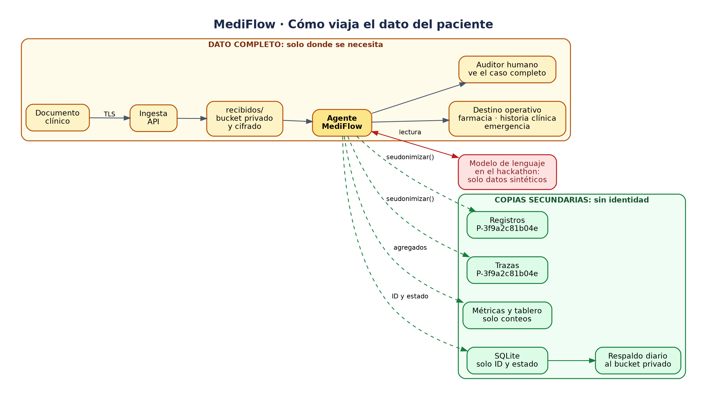

# MediFlow · Privacidad y protección de datos

**Estado:** borrador base para el paquete N2-10, a cargo de Sabrina con Carolina de apoyo, del 9 al
12 de octubre. La sección 7 dice qué se entrega y cómo se demuestra; el resto explica por qué cada
punto está ahí.

MediFlow procesa documentos clínicos, y los datos de salud son la categoría de datos personales más
protegida en todas las legislaciones. Este documento explica cómo está pensado el sistema para
tratarlos y qué falta para usarlo con pacientes reales.

---

## 1. Dos mundos con reglas distintas

**Los datos de prueba no se anonimizan, porque no son de nadie.** Todo el conjunto de prueba es
sintético: pacientes, médicos, matrículas e instituciones inventados. Anonimizarlos no protegería a
nadie y rompería la prueba, porque el agente tiene que practicar con documentos que parezcan reales.
Que el conjunto sea sintético es la primera medida de privacidad del proyecto: en ninguna etapa del
hackathon se usaron datos de personas reales. Está documentado en `evals/DATA.md` y en el ADR-005.

**El producto sí protege datos, pero no borrándolos de la entrada.** Con documentos reales, el agente
necesita leer el nombre del paciente, y el destino necesita saber a quién corresponde: la farmacia no
puede entregar un medicamento a un código. La protección no consiste en esconder el dato del flujo
principal, sino en tres cosas:

1. Que el dato vaya **solo a donde tiene que ir**.
2. Que lo vea **solo quien tiene que verlo**.
3. Que las **copias secundarias no lo lleven**: registros, trazas, métricas y reportes.

---

## 2. Dónde vive el dato del paciente



En amarillo, el camino principal: ahí el dato va completo, porque el destino y el auditor lo
necesitan. En verde, las copias secundarias, que nunca llevan la identidad del paciente. En rojo, el
modelo de lenguaje, el punto más delicado, explicado en la sección 5.


| Lugar | ¿Lleva datos identificables? | Por qué | Cómo se protege |
|---|---|---|---|
| Entrada: API y carga de archivos | Sí | Es el documento original | Conexión con TLS |
| `recibidos/` en el bucket | Sí | Original antes de procesar | Bucket privado, cifrado en reposo, acceso por políticas |
| Modelo de lenguaje | Sí | El agente necesita leer el documento | Ver la sección 5: es el punto más delicado |
| `procesados/` por destino | Sí | Farmacia o historia clínica necesitan identificar al paciente | Bucket privado, acceso por políticas |
| `auditoria_humana/` | Sí | El auditor tiene que ver el caso completo | Bucket privado; acceso solo del auditor |
| SQLite: cola y estado | Lo mínimo | Necesita el ID del documento, no el nombre | Guardar el ID y el estado, no datos clínicos |
| Registros de ejecución | **No** | Se copian, se rotan y los leen los desarrolladores | Seudonimización, sección 4 |
| Trazas de cada nodo | **No** | Se muestran en pantalla y en la demo | Seudonimización |
| Métricas, tablero y reportes | **No** | Son agregados | Solo conteos y porcentajes |
| Respaldos de SQLite | Lo mínimo | Copia de la cola y el estado | Al bucket privado, cifrado en reposo |

La regla de fondo es la de "el mínimo necesario": cada lugar guarda solo lo que su función exige.

---

## 3. Marco de referencia

No existe una única norma internacional de datos de salud. MediFlow toma como referencia:

**Internacionales**
- **GDPR** (Unión Europea): los datos de salud son categoría especial, y exige protección de datos
  desde el diseño y por defecto. Define la seudonimización como medida de protección.
- **HIPAA** (Estados Unidos): el principio de usar y mostrar solo el mínimo necesario.
- **ISO/IEC 27001** e **ISO 27799**: gestión de seguridad de la información, la segunda específica
  para salud.

**Latinoamérica**, donde está pensado el producto:
- **Argentina:** Ley 25.326 de Protección de Datos Personales y Ley 26.529 de Derechos del Paciente.
- **Colombia:** Ley 1581 de 2012.
- **Brasil:** LGPD, Ley 13.709.
- **México:** Ley Federal de Protección de Datos Personales en Posesión de los Particulares.
- **Chile:** Ley 19.628 y su reforma, la Ley 21.719.

Todas coinciden en tratar los datos de salud como sensibles, con protección reforzada.

**Cómo decirlo con honestidad:** MediFlow está **diseñado según los principios** de estas normas. No
decimos que las "cumple": cumplir exige evaluaciones, auditorías y procesos que un prototipo de
hackathon no puede tener. Mostrar cómo cada principio se traduce en un control concreto, sección 6,
es lo que demuestra que el equipo entiende el problema.

---

## 4. Seudonimización de registros y trazas

Es la propuesta de Néstor, aplicada donde corresponde: reemplazar nombre, DNI e historia clínica por
un código en todo lo que no sea el flujo principal.

**Por qué no alcanza con un hash común.** Un hash convierte un dato en un código del que no se puede
volver atrás directamente, y siempre da el mismo código para el mismo dato. Pero los DNI posibles
son pocos millones: cualquiera puede calcular el código de todos y armar una tabla para revertirlos.
Por eso el código se calcula con una **clave secreta** que solo conoce el sistema, lo que se llama
HMAC. Sin la clave, la tabla no se puede armar.

Una implementación posible, para `agent/privacidad.py`:

```python
import hashlib
import hmac
import os
import re


def seudonimizar(valor: str | None) -> str | None:
    """Reemplaza un identificador por un código estable.

    El mismo valor da siempre el mismo código, así se puede seguir a un paciente en los registros
    sin conocerlo. Sin la clave secreta, el código no se puede revertir.
    """
    if not valor:
        return valor
    clave = os.environ["MEDIFLOW_CLAVE_SEUDONIMO"].encode()
    normalizado = re.sub(r"[\s.\-]", "", valor).upper()  # "30.123.456" y "30123456" dan lo mismo
    return "P-" + hmac.new(clave, normalizado.encode(), hashlib.sha256).hexdigest()[:12]
```

- La clave va en el `.env` y en el gestor de secretos de OCI en producción. En `.env.example` va la
  variable **sin valor**. Nunca en el repositorio.
- Se aplica a `paciente.nombre`, `paciente.fecha_nacimiento`, DNI e historia clínica cuando aparecen
  en registros, trazas o reportes.
- **No se aplica** al flujo principal: el documento que llega al destino operativo y lo que ve el
  auditor siguen completos, porque los necesitan.

---

## 5. El proveedor del modelo

Es el punto más delicado. Durante el hackathon, MediFlow usa el plan gratuito de Gemini. Según los
términos adicionales de la API de Gemini (https://ai.google.dev/terms), en los servicios gratuitos
Google usa el contenido enviado para mejorar sus productos, revisores humanos pueden leer las
entradas y salidas, y los términos piden no enviar información sensible ni personal. En el plan
pago, en cambio, el contenido no se usa para mejorar productos y se trata bajo un anexo de
tratamiento de datos.

Para el hackathon esto no es un problema, porque todos los datos son sintéticos. Pero define un
límite claro, registrado en el ADR-010:

- **Mientras se use un plan gratuito, MediFlow no puede recibir documentos de pacientes reales.** La
  interfaz lo avisa en la pantalla de carga.
- **Con datos reales**, hace falta un proveedor con acuerdo de tratamiento de datos, como el plan
  pago de Gemini o Vertex AI, o un modelo propio sobre infraestructura del hospital. Los respaldos
  que ya usa el agente, Qwen y Mistral, son modelos abiertos que se pueden alojar en una máquina
  propia, sin que el documento salga de la institución.

---

## 6. Principios y controles

| Principio | Control en MediFlow | Dónde | Estado |
|---|---|---|---|
| Datos de prueba sin personas reales | Conjunto 100 % sintético | `evals/DATA.md`, ADR-005 | Hecho |
| Minimización | Se extraen solo los campos del contrato | `api-contract.md`, `extraer.py` | Hecho |
| Supervisión humana | Ninguna decisión dudosa sale sin auditoría | Cola de revisión, `enrutar.py` | Hecho |
| Transparencia | Qué hace el agente y qué no, por escrito | `alcance-y-limites.md` | Hecho |
| Límite del proveedor | Sin datos reales en el plan gratuito | ADR-010 | Decidido |
| Confidencialidad en reposo | Bucket privado, cifrado por defecto en OCI | Infraestructura | Verificar |
| Confidencialidad en tránsito | TLS en Nginx | N2-01 | En plan |
| Acceso mínimo | Políticas de acceso por rol al bucket | N2-02 | En plan |
| Seudonimización | Códigos con clave secreta en registros y trazas | `agent/privacidad.py` | Pendiente, N2-10 |
| Trazabilidad de auditoría | Quién resolvió, cuándo y por qué | `resolucion.json`, N2-06 | En plan |
| Respaldo | Copia diaria de SQLite al bucket privado | N2-10 | Pendiente |
| Aviso al usuario | "No suba documentos de pacientes reales" | Pantalla de carga | Pendiente |
| Retención y borrado | Plazo de conservación de los originales | Fuera del MVP | Documentado |
| Derechos de los titulares | Acceso, rectificación y supresión | Fuera del MVP | Documentado |

---

## 7. El entregable de N2-10

El plan lo define así: el respaldo diario y este documento, con dos condiciones para darlo por
terminado, que un respaldo se restaure en prueba y que los registros no contengan nombres de
pacientes. Con la seudonimización sumada, se entregan cuatro cosas.

| Entregable | Qué es |
|---|---|
| **1. El código** | `agent/privacidad.py`, con `seudonimizar()` de la sección 4, y sus pruebas |
| **2. Aplicarlo** | Todo registro y toda traza usan esa función: donde diría "FERREYRA, Norberto", dice "P-3f9a2c81b04e" |
| **3. El respaldo** | Copia diaria de la base SQLite al bucket privado, y la prueba de que se restaura |
| **4. Este documento** | La tabla de la sección 6 con cada control en "Hecho", y al lado su evidencia |

### Cómo se demuestra

En privacidad, decir "lo cuidamos" no alcanza: hay que mostrarlo. Estas tres evidencias son las que
dan por terminado el paquete y las que se presentan al jurado.

**1. La prueba de fuga.** Un test automático que corre el conjunto de prueba completo y después busca,
en registros, trazas y base de datos, cada nombre, DNI e historia clínica de los documentos. El
resultado tiene que ser **cero coincidencias**. Corre en el CI con cada PR: si alguien agrega un
registro que filtra un nombre, se entera en ese momento y no en la demo.

**2. Las dos pantallas lado a lado.** La página de trazas muestra "P-3f9a2c81b04e"; la del auditor
muestra el documento completo, con el nombre. El contraste explica todo el diseño en cinco segundos:
el dato completo solo donde se necesita.

**3. El mismo paciente, el mismo código.** GS-22 y GS-30 son del mismo paciente, Diego Fernández
Martínez. En las trazas, los dos tienen que mostrar el mismo código. Demuestra que se puede seguir a
un paciente a lo largo de sus documentos sin conocer su identidad.

### Criterios de aceptación

El paquete está terminado cuando todo esto es verdad y se puede comprobar:

- [ ] Las pruebas de `seudonimizar()` pasan: el mismo valor da el mismo código, "30.123.456" y
      "30123456" dan el mismo código, un valor vacío no falla, y con otra clave el código cambia.
- [ ] La prueba de fuga da cero coincidencias sobre los 45 elementos del conjunto, y corre en el CI.
- [ ] GS-22 y GS-30 muestran el mismo código en las trazas.
- [ ] La traza se **guarda** seudonimizada en el estado del agente, no solo se muestra así: la
      página de trazas, N3-02, llega después y solo tiene que mostrarla.
- [ ] SQLite guarda el ID del documento y su estado, no el nombre ni el DNI.
- [ ] `MEDIFLOW_CLAVE_SEUDONIMO` está en `.env.example`, sin valor, y en ningún archivo del
      repositorio.
- [ ] Un respaldo de SQLite se restaura y la cola queda igual que antes.
- [ ] La pantalla de carga avisa que no se deben subir documentos de pacientes reales.
- [ ] La tabla de la sección 6 está al día, con la evidencia de cada control.

### Dependencias

| De qué | Quién | Qué hacer si no llega |
|---|---|---|
| La máquina virtual, N2-01 | Carlos | Probar el respaldo y la restauración en local: el mecanismo es el mismo. La privacidad no depende de la máquina |
| El grafo completo en `develop` | PR #1 y PR #3 | Sin el grafo no hay registros reales que revisar; la prueba de fuga se puede escribir antes y correr cuando llegue |
| La página de trazas, N3-02, del 13 al 16 | Néstor | Nada: si la traza ya se guarda seudonimizada, la página solo la muestra |
| El aviso en la pantalla de carga | Alessandro | Pedírselo con tiempo: es una línea de texto |
| Bucket privado y acceso mínimo, N2-02 | Carlos | Confirmarlo y registrarlo como evidencia |

## 8. Qué decir en la demo

> "MediFlow se probó solo con datos sintéticos: nunca tocamos datos de un paciente real. En el
> sistema, el dato completo va solo a su destino y a quien lo audita; registros, trazas y métricas
> llevan códigos que no se pueden revertir sin una clave. Y sabemos dónde está el límite: con
> pacientes reales, el modelo tiene que correr bajo un acuerdo de tratamiento de datos o en la
> infraestructura del hospital."
